# 3. System Overview (Tổng quan hệ thống)

## 3.1. Các bên liên quan chính (Main Stakeholders)

IMOVE là ứng dụng hỗ trợ lập kế hoạch và theo dõi hành trình giao thông công cộng tại Singapore. Các bên liên quan chính gồm:

- **Du khách và hành khách:** nhập danh sách địa điểm, số ngày, ngân sách, khách sạn và ưu tiên di chuyển để nhận lịch trình phù hợp.
- **Nhóm phát triển dự án:** xây dựng, kiểm thử, bảo trì thuật toán lập lịch, chấm điểm, thích nghi và giao diện.
- **Nhà cung cấp dữ liệu và dịch vụ:** OneMap, LTA DataMall, OpenWeather, Google Gemini, Supabase và OpenStreetMap.
- **Hội đồng đánh giá học thuật:** đánh giá cách dự án áp dụng phân rã bài toán, nhận diện mẫu, trừu tượng hóa và thiết kế thuật toán.

IMOVE sử dụng dữ liệu và API của các nhà cung cấp để hỗ trợ quyết định cho người dùng. Hệ thống không trực tiếp điều phối hoạt động của các đơn vị vận tải.

## 3.2. Các tác nhân chính (Main Actors / User Types)

| Tác nhân | Nhu cầu chính | Hỗ trợ từ IMOVE |
|---|---|---|
| Du khách lần đầu đến Singapore | Khó chọn thứ tự tham quan và phương tiện | Lập lịch đa điểm, tối ưu thứ tự, hướng dẫn theo từng chặng |
| Người dùng có ưu tiên cá nhân | Muốn cân bằng thời gian, chi phí, đi bộ và chuyển tuyến | Hồ sơ trọng số và các ràng buộc phương tiện |
| Người đang thực hiện hành trình | Cần phản ứng trước mưa hoặc gián đoạn giao thông | Cảnh báo và đề xuất thích nghi |
| Người dùng đã đăng nhập | Muốn lưu lịch trình và sở thích | Supabase Auth, lưu trip, preference và feedback |

## 3.3. Các tính năng cốt lõi (Core Features)

### 3.3.1. Lập lịch trình du lịch đa điểm

Người dùng chọn các địa điểm tại Singapore, số ngày, ngân sách, nơi lưu trú và nhóm ưu tiên di chuyển. Planning Agent phân bổ các địa điểm vào từng ngày, tạo các chặng di chuyển và trả về `TripPlan`.

### 3.3.2. Tối ưu thứ tự có ràng buộc thời gian

Khi bật tối ưu hóa, hệ thống sử dụng heuristic tham lam có xét:

- Khoảng cách Haversine giữa các địa điểm.
- Thời lượng tham quan dự kiến.
- Giờ mở cửa.
- Khung thời gian tham quan trong ngày.
- Địa điểm ban ngày và buổi tối.
- Khách sạn làm điểm bắt đầu và kết thúc ngày nếu được cung cấp.

Đây là heuristic nearest-neighbor có ràng buộc, không phải bộ giải TSP đầy đủ.

### 3.3.3. So sánh và lựa chọn phương tiện

Planning Agent lấy các phương án theo từng chặng từ OneMap và chuẩn hóa về các mode:

- `METRO`
- `BUS`
- `WALK`
- `CYCLE`
- `GRAB`

Mỗi phương án được đánh giá dựa trên thời gian, chi phí, thời gian đi bộ và số lần chuyển tuyến. Phương án có điểm phù hợp nhất được chọn làm đề xuất mặc định, nhưng người dùng vẫn có thể đổi mode.

### 3.3.4. Chấm điểm thích nghi theo bối cảnh

Scoring Service sử dụng trọng số trong `UserPreferenceProfile` và `ContextSnapshot`. Khi có mưa hoặc đang trong giờ cao điểm, trọng số được điều chỉnh trước khi xếp hạng:

- Mưa làm giảm mức ưu tiên của phương án cần đi bộ nhiều.
- Giờ cao điểm tăng mức quan trọng của việc giảm chuyển tuyến.
- Các ràng buộc như tránh bus, tránh metro, giảm đi bộ và giảm chi phí được áp dụng khi phù hợp.

### 3.3.5. Thích nghi với cảnh báo giao thông và thời tiết

Adaptation Agent định kỳ kiểm tra:

- Cảnh báo tàu từ LTA DataMall.
- Thời tiết từ OpenWeather.

Khi phát hiện vấn đề ảnh hưởng hành trình, hệ thống có thể tạo đề xuất đổi địa điểm ngoài trời sang địa điểm trong nhà hoặc tính lại chặng bị ảnh hưởng. Thay đổi chỉ được lưu khi người dùng chấp nhận.

### 3.3.6. Học từ phản hồi

Memory Agent lưu phản hồi trực tiếp và thay đổi phương tiện. Hệ thống nhận diện một số mẫu lặp đơn giản:

- Ít nhất hai lần đổi `BUS -> MRT` làm xuất hiện xu hướng ưu tiên MRT.
- Ít nhất hai lần đổi sang `WALK` làm tăng giới hạn đi bộ của người dùng.

### 3.3.7. Hỗ trợ bằng Gemini

Gemini được sử dụng cho các tác vụ ngôn ngữ phù hợp:

- Trích xuất tên địa điểm từ văn bản.
- Đề xuất địa điểm theo phong cách du lịch.
- Sinh cảnh báo lịch trình và thông báo khoảng trống.
- Vận hành chatbot có khả năng gọi các công cụ nội bộ.

Các quyết định lập lịch và chấm điểm cốt lõi vẫn được thực hiện bằng thuật toán xác định và dữ liệu có cấu trúc.

## 3.4. Điểm nhấn đổi mới (Innovation Highlights)

- **Hybrid planning:** kết hợp heuristic, scoring xác định, external routing API và LLM thay vì giao toàn bộ quyết định cho AI.
- **Context-aware recommendation:** thay đổi cách xếp hạng theo mưa, giờ cao điểm và preference của người dùng.
- **Graceful degradation:** vẫn tạo được ước tính đi bộ hoặc Grab khi một số mode của OneMap không khả dụng.
- **Human-in-the-loop adaptation:** hệ thống tạo đề xuất thay đổi nhưng người dùng quyết định có áp dụng hay không.
- **Preference learning có thể giải thích:** các quy tắc học từ feedback đơn giản, minh bạch và dễ kiểm thử.

## 3.5. Kiến trúc tổng quan

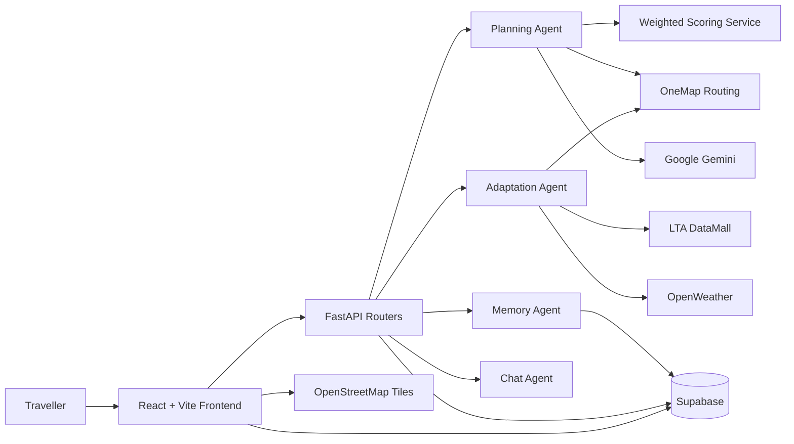

Luồng chính bắt đầu từ Frontend, đi qua các FastAPI router và được chuyển đến Agent hoặc Service phù hợp. Supabase cung cấp persistence, authentication và realtime alerts; các dịch vụ bên ngoài cung cấp dữ liệu routing, transit, thời tiết và AI.

# 4. Pattern Recognition (Nhận diện mẫu)

## 4.1. Khái niệm và vai trò

Pattern Recognition trong IMOVE là việc nhận diện những cấu trúc hoặc hành vi lặp lại để tái sử dụng một chiến lược xử lý phù hợp. Dự án không xây dựng một mô hình machine learning dự đoán giao thông riêng; thay vào đó, hệ thống áp dụng các pattern xác định trong lập lịch, chấm điểm, kiểm tra dữ liệu, học preference và xử lý lỗi.

Các pattern giúp hệ thống:

- Giảm số trường hợp phải xử lý riêng lẻ.
- Tạo hành vi nhất quán giữa các chặng và các ngày.
- Cá nhân hóa đề xuất từ preference và feedback.
- Phản ứng ổn định khi external service không trả về đầy đủ dữ liệu.

## 4.2. Các pattern được nhận diện trong IMOVE

| Nhóm pattern | Mẫu được nhận diện | Implementation | Ý nghĩa |
|---|---|---|---|
| Validation | Mọi địa điểm phải có trường bắt buộc và thời gian hợp lệ | `_REQUIRED_KEYS`, `_validate_time()` | Phát hiện dữ liệu lỗi khi khởi động |
| Structural | Một hành trình gồm nhiều ngày; mỗi ngày gồm nhiều leg | `TripPlan`, `DayPlan`, `LegResponse` | Chuẩn hóa dữ liệu giữa backend và frontend |
| Scheduling | Điểm gần và còn phù hợp time window nên được xét trước | `_day_bucketed_greedy()` | Tạo lịch trình thực dụng |
| Distribution | Địa điểm phải được phân bổ vào số ngày giới hạn | `_distribute_days()` | Tránh dồn toàn bộ địa điểm vào một ngày |
| Context | Mưa và giờ cao điểm làm thay đổi ưu tiên | `ContextSnapshot`, `_effective_weights()` | Xếp hạng thích nghi |
| Ranking | Các mode được so sánh trên cùng bốn dimension | `score_alternatives()` | Chọn mode phù hợp nhất |
| Behavioral | Thay đổi mode lặp lại thể hiện preference | `learn_from_implicit()` | Học xu hướng người dùng |
| Resilience | Một mode hoặc service có thể không khả dụng | `NoRouteError`, Haversine/Grab estimates | Duy trì kết quả có ích |
| Adaptation | Cảnh báo giao thông và mưa cần được kiểm tra định kỳ | `poll_lta_alerts()`, `poll_weather_alerts()` | Đề xuất thay đổi hành trình |

## 4.3. Pattern lập lịch tham lam có ràng buộc

### 4.3.1. Nhận diện bài toán

Việc sắp thứ tự địa điểm có nét tương đồng với nearest-neighbor routing, nhưng IMOVE phải đồng thời xét giờ mở cửa, thời lượng tham quan, số ngày và phân loại buổi tối. Vì vậy, `_day_bucketed_greedy()` sử dụng heuristic thay vì exhaustive search.

### 4.3.2. Quy trình

1. Phân loại địa điểm thành daytime/overlap và evening.
2. Tạo các bucket theo số ngày.
3. Dùng khách sạn hoặc vị trí neo làm điểm bắt đầu.
4. Trong mỗi ngày, lọc các địa điểm còn phù hợp giờ mở cửa và giới hạn ngày.
5. Chọn địa điểm gần nhất trong tập hợp hợp lệ.
6. Dừng thêm điểm vào một ngày khi đạt time budget.
7. Phân bổ địa điểm buổi tối sau khi lịch ban ngày đã ổn định.
8. Sinh warning cho các địa điểm không thể nằm trong time window.

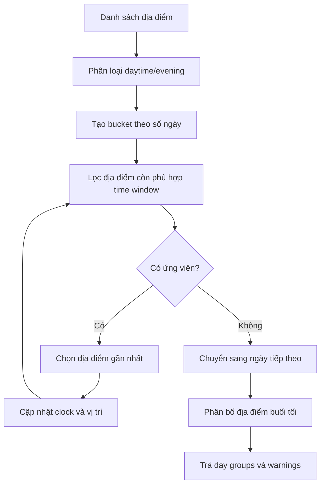

Độ phức tạp xấp xỉ `O(n^2)` do mỗi vòng lặp tìm địa điểm gần nhất trong tập còn lại. Cách tiếp cận này phù hợp với số địa điểm được chọn trong một chuyến du lịch thông thường.

## 4.4. Pattern chấm điểm và xếp hạng

### 4.4.1. Chuẩn hóa tương đối

Mỗi mode có bốn dimension:

- `duration`: tổng thời gian.
- `cost`: chi phí.
- `walk`: số phút đi bộ.
- `transfers`: số lần chuyển tuyến.

Vì đơn vị đo khác nhau, mỗi dimension được chuẩn hóa trong tập alternative của cùng một leg:

```text
normalized(value) = 1 - (value - min_value) / (max_value - min_value)
```

Giá trị thấp hơn được xem là tốt hơn. Nếu mọi mode bằng nhau trên một dimension, dimension đó nhận giá trị trung lập `1.0`.

### 4.4.2. Điều chỉnh theo bối cảnh

`_effective_weights()` nhận diện các mẫu bối cảnh:

- Mưa nhẹ hoặc mưa lớn làm giảm `walking_w`.
- Giờ cao điểm làm tăng `transfers_w`.
- `minimize_walking` tăng `walking_w`.
- `minimize_fee` tăng `cost_w`.

Sau điều chỉnh, các trọng số được chuẩn hóa lại để tổng bằng `1.0`.

### 4.4.3. Weighted score

```text
score(mode) =
    duration_w  * normalized_duration
  + cost_w      * normalized_cost
  + walking_w   * normalized_walking
  + transfers_w * normalized_transfers
```

Kết quả được sắp xếp giảm dần; mode đầu tiên trở thành `recommended_mode`.

## 4.5. Pattern học từ hành vi

Memory Agent không dùng LLM để diễn giải feedback. Thay vào đó, nó quét các implicit feedback đã lưu trong bảng `trip_feedback` và áp dụng các quy tắc có thể giải thích:

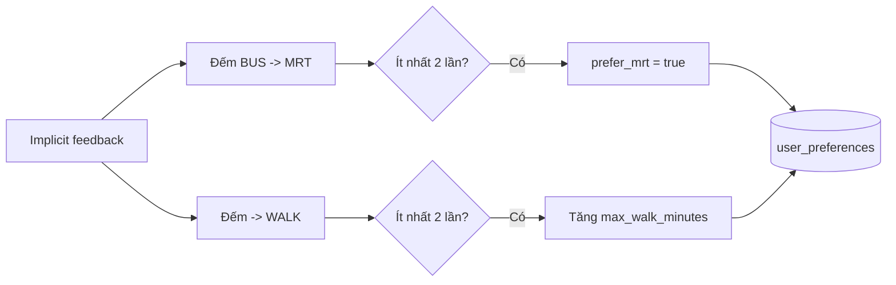

Pattern này minh họa cách một hành vi lặp lại được chuyển thành preference có cấu trúc.

## 4.6. Pattern chịu lỗi và fallback

OneMap có thể không trả về route cho một hoặc nhiều mode. IMOVE xử lý theo chuỗi:

1. Lấy song song các route public transit, bus-only, walk, cycle và drive.
2. Mode thất bại được xem là không khả dụng thay vì làm hỏng toàn bộ yêu cầu.
3. Nếu drive không khả dụng, hệ thống tạo Grab estimate từ khoảng cách Haversine.
4. Nếu không có transit và khoảng cách dưới 2 km, hệ thống tạo walking estimate.
5. Nếu khoảng cách dài và chỉ còn Grab, hệ thống chọn Grab.
6. Nếu không có phương án khả dụng, hệ thống raise `NoRouteError`.

Đây là graceful degradation dựa trên khả năng còn lại, không phải cơ chế dự đoán lỡ chuyến.

## 4.7. Kết luận Pattern Recognition

Pattern Recognition trong IMOVE tập trung vào các mẫu có thể quan sát và kiểm thử: cấu trúc trip/leg, nearest-neighbor scheduling, context-aware scoring, hành vi đổi mode, polling cảnh báo và fallback khi API thất bại. Việc giới hạn pattern vào implementation thực tế giúp báo cáo phản ánh đúng năng lực hiện tại của hệ thống.

# 5. Abstraction (Trừu tượng hóa)

## 5.1. Khái niệm và vai trò

Abstraction là quá trình che giấu chi tiết triển khai không cần thiết và cung cấp một giao diện hoặc mô hình dễ sử dụng hơn cho tầng phía trên. Trong IMOVE, abstraction giúp tách giao diện, API, Agent, Service, model dữ liệu và persistence.

## 5.2. Các tầng abstraction thực tế

### 5.2.1. Frontend abstraction

Frontend React cung cấp các page, component, hook và service:

- Page điều phối luồng người dùng.
- Component hiển thị map, route, alert và phương án thay thế.
- Hook quản lý trip, saved trip, geolocation và alerts.
- `frontend/src/services/api.js` đóng gói HTTP request, authentication header và local cache helpers.

Người dùng thao tác với itinerary và route card mà không cần biết chi tiết OneMap, Supabase hoặc scoring backend.

### 5.2.2. Router abstraction

FastAPI routers chia API theo trách nhiệm:

| Router | Trách nhiệm |
|---|---|
| `trips` | Tạo, lập kế hoạch, sửa, tối ưu và thích nghi trip |
| `places` | Danh sách địa điểm, geocoding và AI suggestion |
| `alerts` | Feedback và preference liên quan cảnh báo |
| `transit` | Bus arrival và route comparison |
| `preferences` | Đọc và cập nhật weighted preference |
| `chat` | Chatbot và xác nhận tool action |

Router chuyển request thành lời gọi Agent/Service và chuyển kết quả thành response HTTP.

### 5.2.3. Agent abstraction

| Agent | Nhiệm vụ cấp cao |
|---|---|
| Planning Agent | Phân bổ địa điểm, lấy alternatives, chấm điểm và tạo `TripPlan` |
| Adaptation Agent | Kiểm tra cảnh báo và tạo đề xuất thay đổi |
| Memory Agent | Lưu feedback và học preference đơn giản |
| Chat Agent | Điều phối vòng lặp Gemini function calling |

Agent abstraction giúp tách use case cấp cao khỏi chi tiết HTTP hoặc UI.

### 5.2.4. Service abstraction

Các service đóng gói tương tác hoặc thuật toán chuyên biệt:

- `onemap.py`: geocoding và multimodal routing.
- `lta.py`: bus arrival và train service alerts.
- `openweather.py`: dữ liệu thời tiết.
- `gemini.py`: các tác vụ Gemini.
- `scoring.py`: normalization và weighted scoring.

Đây là module abstraction, không phải một hệ thống provider interface đa nhà cung cấp. Hiện tại dự án chưa có implementation cho OpenAI Provider hoặc Local LLM Provider.

### 5.2.5. Model abstraction

Pydantic models tạo contract có kiểu dữ liệu rõ ràng:

- `TripPlan`, `DayPlan`, `LegResponse`, `AlternativeRoute`.
- `UserPreferenceProfile`, `ModeConstraints`, `ContextSnapshot`.
- Request và response model cho các thao tác trip.

Nhờ đó, Agent và Router trao đổi object có cấu trúc thay vì dictionary không kiểm soát.

### 5.2.6. Data và persistence abstraction

IMOVE sử dụng nhiều lớp dữ liệu:

- `singapore_places.json` là curated dataset được load và validate khi backend khởi động.
- Supabase PostgreSQL lưu trip, route leg, place relation, alert, feedback và preference.
- Supabase Auth xác thực người dùng.
- In-memory store hỗ trợ phiên hoạt động và fallback khi Supabase không khả dụng.
- Frontend localStorage lưu metadata/cache cục bộ.

Supabase là persistence chính; JSON và localStorage không thay thế toàn bộ database.

### 5.2.7. Context abstraction

`ContextSnapshot` gom dữ liệu bối cảnh cần cho scoring:

- `rain_mm_per_hour`
- `current_time_minutes`
- `rain_level`
- `is_peak_hours`

Scoring Service chỉ cần nhận `ContextSnapshot`, không cần biết cách OpenWeather được gọi hoặc múi giờ Singapore được tính.

### 5.2.8. Fault-tolerant abstraction

Các lớp phía trên nhận kết quả route đã được chuẩn hóa thành `AlternativeRoute` và `LegResponse`. Chi tiết mode nào thất bại, Grab được ước tính ra sao hoặc instruction của OneMap được làm phẳng được xử lý bên trong Planning Agent và Service.

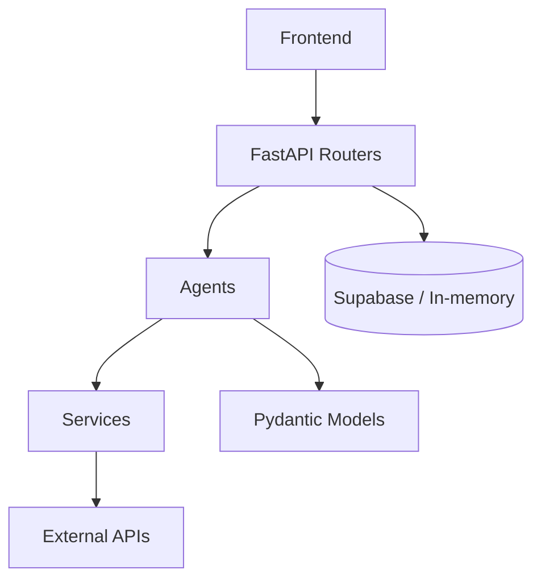

## 5.3. Abstraction trong Hybrid Planning

Planning Agent kết hợp code xác định và Gemini nhưng giữ ranh giới trách nhiệm:

- Code xác định xử lý validation, scheduling, routing, scoring và fallback.
- Gemini xử lý tác vụ ngôn ngữ hoặc trường hợp hỗ trợ như resolve tên địa điểm và sinh thông báo.
- Lỗi Gemini không được phép làm hỏng luồng planning cốt lõi trong các nhánh đã có fallback.

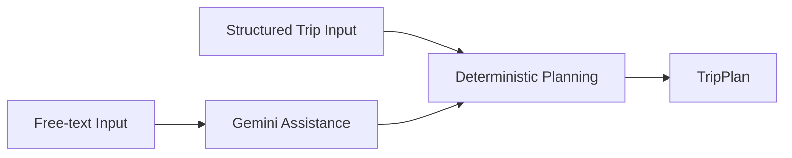

## 5.4. Lợi ích và giới hạn

### Lợi ích

- Tách trách nhiệm giữa UI, API, Agent và Service.
- Dễ kiểm thử từng module.
- Giảm phụ thuộc trực tiếp của business logic vào giao diện.
- Chuẩn hóa dữ liệu route và preference.
- Cho phép hệ thống tiếp tục hoạt động một phần khi external service thất bại.

### Giới hạn hiện tại

- Chưa có interface chung để thay thế linh hoạt nhiều AI provider.
- Chưa phải kiến trúc distributed system độc lập theo từng service.
- Một phần persistence logic vẫn nằm trong router.
- Curated places dataset được load trực tiếp trong Planning Agent.
- In-memory state mất khi backend restart nếu chưa được persist.

## 5.5. Mối quan hệ giữa Abstraction và Pattern Recognition

Pattern Recognition xác định cấu trúc lặp lại; Abstraction đóng gói cách xử lý cấu trúc đó:

| Pattern nhận diện | Abstraction tương ứng |
|---|---|
| Trip gồm day và leg | Pydantic trip models |
| Mọi mode có duration/cost/walk/transfers | `AlternativeRoute` và Scoring Service |
| Mưa và giờ cao điểm ảnh hưởng preference | `ContextSnapshot` |
| External APIs có thể thất bại | Service modules và fallback logic |
| Feedback lặp lại thể hiện preference | Memory Agent |

## 5.6. Kết luận Abstraction

Abstraction của IMOVE chủ yếu được thể hiện qua module boundaries, Agent, Service, Router và typed models. Báo cáo không giả định các provider interface hoặc distributed architecture chưa được triển khai; các hướng đó có thể được xem là future work.

# 6. System / Algorithm Design (Thiết kế hệ thống và Thuật toán)

## 6.1. Công nghệ áp dụng (Technical Stacks Applied)

| Tầng | Công nghệ |
|---|---|
| Frontend | React 18, Vite, React Router, Tailwind CSS 4, React Leaflet |
| Backend | Python, FastAPI, Pydantic, APScheduler |
| Database và Auth | Supabase PostgreSQL, Supabase Auth, Row Level Security |
| Routing và geocoding | OneMap API |
| Realtime transit | LTA DataMall |
| Weather | OpenWeather |
| AI | Google Gemini 2.5 Flash |
| Map tiles | OpenStreetMap |
| Testing | Pytest, Vitest, Testing Library |

Frontend được build bằng Vite. Backend FastAPI cung cấp REST API riêng; backend không phải static-file server cho frontend.

## 6.2. Kiến trúc hệ thống theo mô hình C4

### 6.2.1. C4 Level 1: System Context

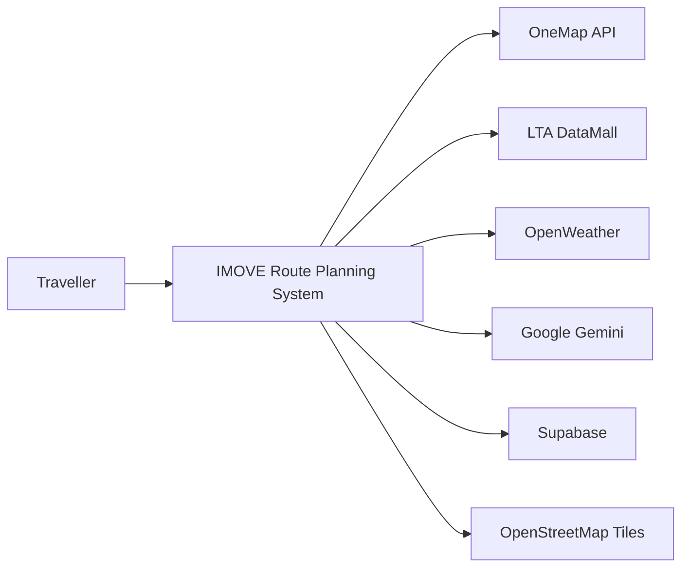

| External system | Dữ liệu hoặc chức năng |
|---|---|
| OneMap | Geocoding, public transit, bus-only, walking, cycling và driving route |
| LTA DataMall | Bus arrival và train disruption |
| OpenWeather | Current weather và forecast |
| Google Gemini | NLP, suggestion, warning và chatbot |
| Supabase | PostgreSQL, Auth, RLS và realtime |
| OpenStreetMap | Tile nền cho bản đồ |

### 6.2.2. C4 Level 2: Container Diagram

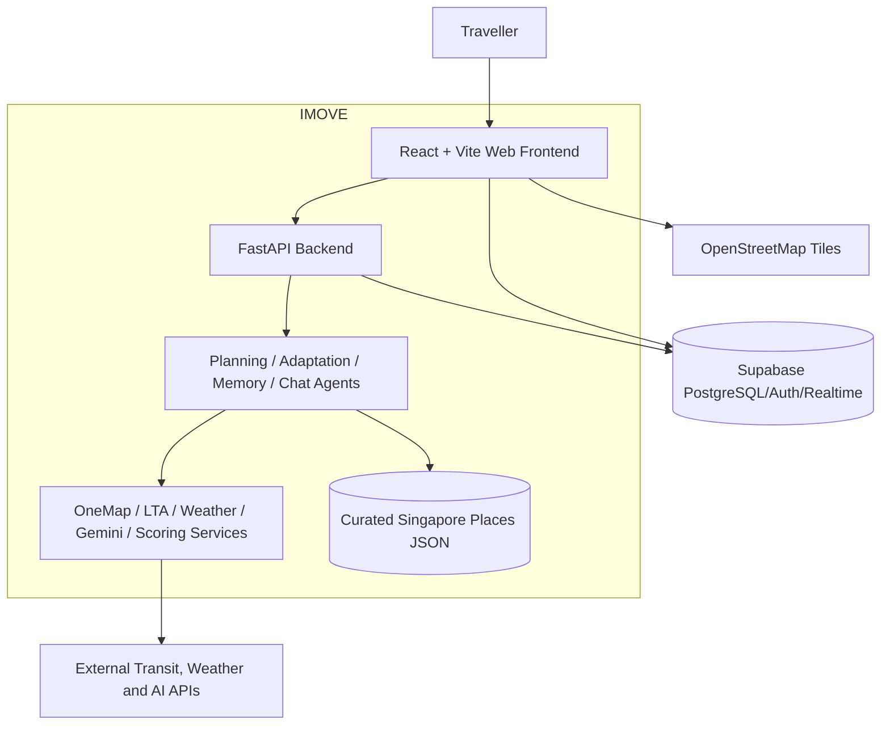

### 6.2.3. Container responsibilities

- **Web Frontend:** quản lý interaction, hiển thị itinerary, map, route alternatives, alerts và settings.
- **FastAPI Backend:** expose REST endpoints, validation request, ownership check và điều phối use case.
- **Agents:** thực hiện planning, adaptation, memory learning và chat tool orchestration.
- **Services:** đóng gói external APIs và scoring algorithm.
- **Supabase:** persistence, authentication, RLS và realtime alerts.
- **Curated Places JSON:** cung cấp địa điểm Singapore đã được chuẩn hóa.

## 6.3. Quản lý trạng thái và luồng dữ liệu

Trạng thái được chia theo phạm vi:

| Phạm vi | Cơ chế | Ví dụ |
|---|---|---|
| UI component/page | React state và hooks | selected places, active tab, modal state |
| Frontend cache | localStorage helpers | saved trip metadata và trip cache |
| Backend session | in-memory dictionaries | active trip, pending swap, chat state |
| Persistent data | Supabase | trips, route legs, preferences, alerts, feedback |
| Context tạm thời | `ContextSnapshot` | mưa và giờ hiện tại cho scoring |

Luồng lập kế hoạch:

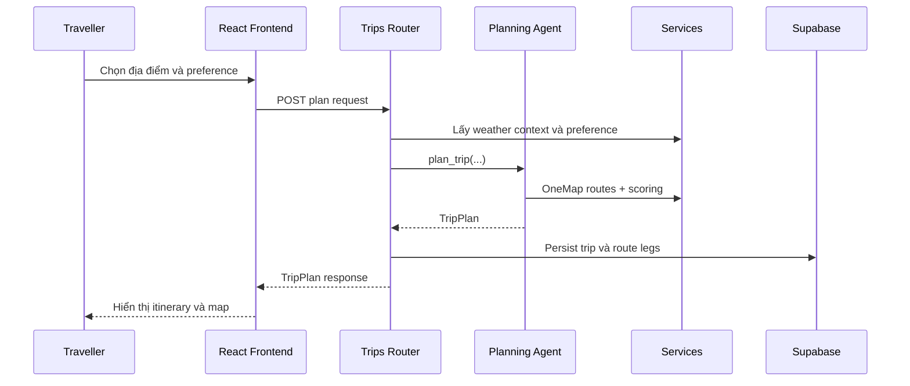

## 6.4. Thiết kế thuật toán Planning Agent

### 6.4.1. Planning pipeline

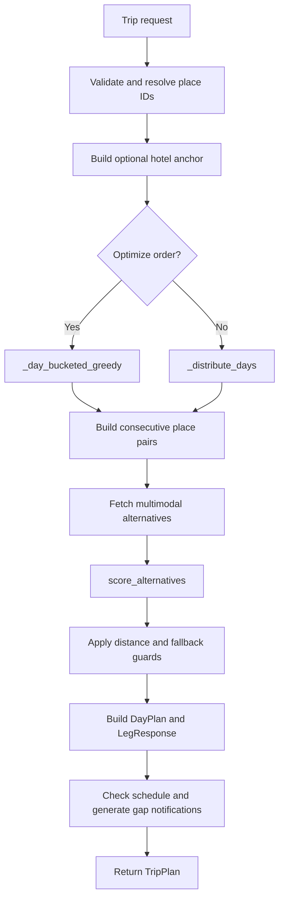

### 6.4.2. Validation và resolve địa điểm

Khi backend khởi động, curated place dataset được kiểm tra bằng `_REQUIRED_KEYS` và `_validate_time()`. Khi lập trip:

- ID hợp lệ được lấy trực tiếp từ curated dataset.
- ID hoặc tên không nhận diện được có thể được Gemini hỗ trợ resolve.
- Nếu vẫn không tìm thấy, Planning Agent raise `PlaceDataMissingError`.

### 6.4.3. Phân bổ địa điểm

Có hai strategy:

- **Optimize path:** `_day_bucketed_greedy()` chọn và phân bổ địa điểm dựa trên khoảng cách và time window.
- **Non-optimize path:** `_distribute_days()` giữ thứ tự người dùng và phân bổ nhanh bằng dwell-time estimate.

Việc tách hai path giúp người dùng chỉnh sửa nhanh khi chưa yêu cầu tính route thật, đồng thời vẫn có lựa chọn tối ưu hóa đầy đủ khi cần.

### 6.4.4. Lấy route alternatives

`_fetch_all_alternatives()` gọi song song các mode OneMap:

```text
pt, pt(bus-only), walk, cycle, drive
```

Kết quả được chuyển thành:

```text
METRO, BUS, WALK, CYCLE, GRAB
```

GRAB sử dụng dữ liệu drive khi có; nếu drive thất bại, hệ thống ước tính từ Haversine, tốc độ đô thị và công thức giá.

## 6.5. Thiết kế thuật toán Scoring

### 6.5.1. Input và output

`score_alternatives()` nhận:

- `alternatives: dict[str, AlternativeRoute]`
- `profile: UserPreferenceProfile`
- `context: ContextSnapshot`

Kết quả là `ScoringResult`, gồm danh sách mode đã xếp hạng, `recommended_mode`, thông tin context đã áp dụng và reasoning.

### 6.5.2. Các bước tính điểm

1. Lọc hard constraints như tránh bus hoặc metro.
2. Trích xuất duration, cost, walking minutes và transfers.
3. Tính min/max cho từng dimension.
4. Chuẩn hóa các giá trị theo hướng thấp hơn là tốt hơn.
5. Điều chỉnh weight theo mưa, giờ cao điểm và soft constraints.
6. Tính weighted score.
7. Áp dụng penalty nếu người dùng tránh route có nhiều lần chuyển.
8. Sắp xếp giảm dần và đánh dấu mode đầu tiên là recommended.

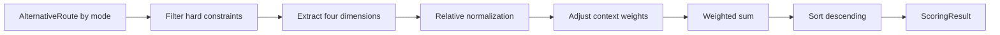

## 6.6. Thiết kế thuật toán Adaptation

### 6.6.1. Polling và phát hiện cảnh báo

APScheduler chạy:

- `poll_lta_alerts()` mỗi 2 phút.
- `poll_weather_alerts()` mỗi 30 phút.

Ngoài polling tự động, frontend có thể yêu cầu kiểm tra cảnh báo cho một trip sắp diễn ra.

### 6.6.2. Tạo đề xuất thích nghi

Khi cảnh báo ảnh hưởng trip:

- Mưa có thể kích hoạt đề xuất thay địa điểm ngoài trời bằng địa điểm trong nhà gần nhất.
- Gián đoạn MRT có thể kích hoạt reroute các leg sử dụng tuyến bị ảnh hưởng.
- Leg mới được tính lại và kèm delta về chi phí, thời gian và quãng đường đi bộ.
- Proposal được giữ tạm thời; chỉ persist khi người dùng chấp nhận.

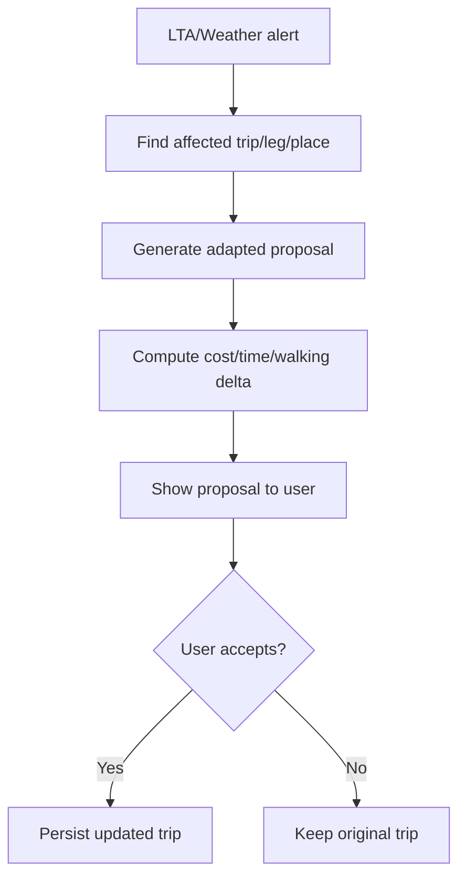

## 6.7. Thiết kế Memory Agent

Memory Agent sử dụng feedback đã lưu:

1. `save_feedback()` ghi explicit hoặc implicit feedback.
2. `learn_from_implicit()` lấy các comment thay đổi mode của người dùng.
3. Đếm các pattern được hỗ trợ.
4. Cập nhật `user_preferences` khi vượt threshold.

Thuật toán hiện tại là rule-based, không phải mô hình machine learning hoặc LLM sentiment analysis.

## 6.8. Cơ chế chịu lỗi

| Trường hợp | Xử lý |
|---|---|
| Một mode OneMap thất bại | Bỏ mode đó, giữ các mode còn lại |
| Drive route thất bại | Tạo Grab estimate bằng Haversine |
| Không có transit cho quãng ngắn | Tạo walking estimate |
| Không có transit cho quãng dài nhưng có Grab | Chọn Grab |
| Không còn route khả dụng | Raise `NoRouteError` |
| Gemini sinh schedule warning thất bại | Trả fallback warning xác định |
| Supabase không khả dụng ở một số luồng | Dùng in-memory fallback hoặc bỏ qua persistence không bắt buộc |
| LTA không khả dụng | Báo lỗi dịch vụ thay vì làm crash backend |

## 6.9. Giới hạn và Future Work

Các nội dung sau là hướng phát triển, chưa được trình bày như tính năng hiện có:

- Departure urgency engine với trạng thái `OK`, `HURRY`, `MISS`.
- Daily routine plan và Smart Override.
- Dữ liệu crowding realtime dùng trực tiếp trong scoring.
- Health hoặc emotion processor.
- TSP solver đầy đủ.
- Interface chung cho nhiều AI provider.
- Hỗ trợ nhiều thành phố ngoài Singapore.

## 6.10. Kết luận System / Algorithm Design

IMOVE hiện sử dụng kiến trúc React/Vite - FastAPI - Supabase kết hợp các Agent và Service chuyên trách. Thuật toán cốt lõi dựa trên greedy scheduling có ràng buộc, relative weighted scoring, rule-based preference learning và fallback khi external service thất bại. Gemini hỗ trợ xử lý ngôn ngữ nhưng không thay thế logic planning xác định.
