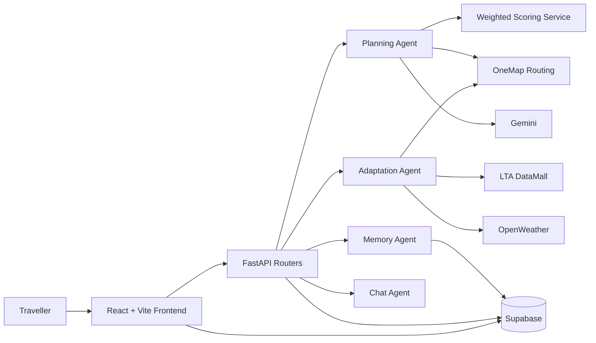
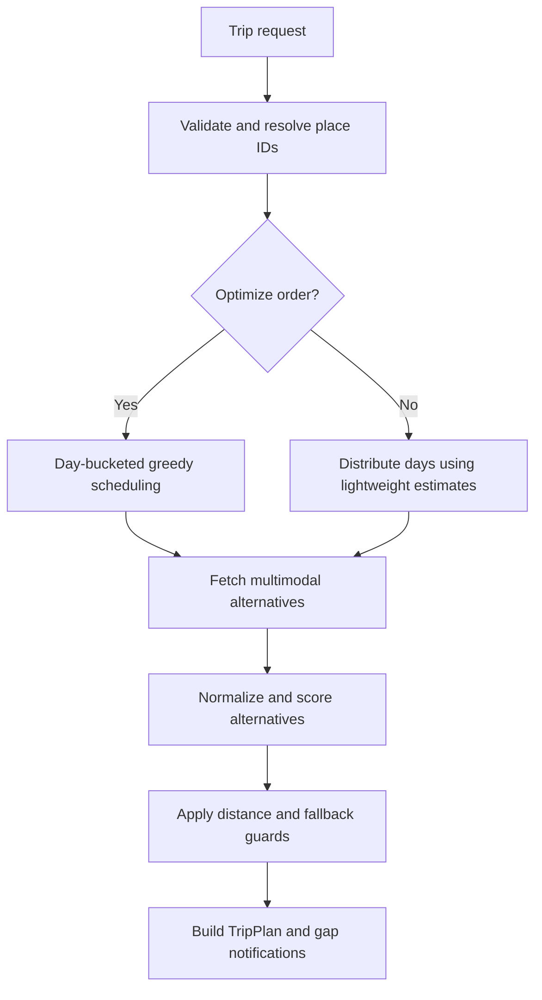

# Huong dan sua `OverviewPatternAbstractionAlgorithm.md`

> Trang thai: Da ap dung vao `OverviewPatternAbstractionAlgorithm.md` ngay 2026-06-09.
> Cac tinh nang chua trien khai chi duoc giu trong muc Future Work.

## 1. Muc tieu

Tai lieu nay la checklist de chinh sua `OverviewPatternAbstractionAlgorithm.md` sao cho bao cao phan anh dung implementation hien tai cua IMOVEV2.

Nguyen tac khi sua:

- Chi mo ta mot tinh nang la **da trien khai** khi co ma nguon hoac test chung minh.
- Noi dung moi dung o muc y tuong phai duoc ghi ro la **Future Work**.
- Ma gia phai duoc gan nhan la pseudocode; khong trinh bay ma gia nhu ham dang ton tai.
- Ten cong nghe, service, model AI va API endpoint phai khop voi repository.
- Cac so do kien truc phai the hien dung luong du lieu hien tai.

## 2. Danh gia tong quan

Bao cao hien tai tron lan ba loai noi dung:

1. Tinh nang dang ton tai trong repository.
2. Thiet ke cu hoac prototype khac.
3. Y tuong chua duoc trien khai.

Phan can sua nhieu nhat la **System / Algorithm Design**. Phan nay dang mo ta mot prototype Tokyo su dung mock data va cac ham khong ton tai trong repository hien tai.

## 3. Checklist uu tien

### P0 - Can sua truoc khi nop

- [ ] Viet lai toan bo muc **System / Algorithm Design**.
- [ ] Xoa moi noi dung mo ta he thong danh cho Tokyo.
- [ ] Sua technical stack thanh React 18 + Vite, FastAPI, Supabase va Gemini 2.5 Flash.
- [ ] Viet lai so do C4 theo cac container va external service dang ton tai.
- [ ] Xoa hoac thay the cac ham khong ton tai trong ma nguon.
- [ ] Xoa cac tinh nang `OK`, `HURRY`, `MISS`, Smart Override va Dual Plan Import khoi danh sach tinh nang da trien khai.

### P1 - Can chinh de bao cao chinh xac

- [ ] Viet lai so do kien truc tong quan theo cac Agent va Service thuc te.
- [ ] Sua Pattern Recognition de tap trung vao cac pattern co implementation.
- [ ] Sua Abstraction de phan biet abstraction thuc te va abstraction de xuat.
- [ ] Cap nhat ten mode thanh `METRO`, `BUS`, `WALK`, `CYCLE`, `GRAB`.
- [ ] Sua mo ta database: Supabase la persistent database, in-memory store va localStorage chi la fallback/cache.

### P2 - Cai thien chat luong hoc thuat

- [ ] Dan nhan cac noi dung chua trien khai la Future Work.
- [ ] Chen link den ma nguon hoac ten symbol sau moi thuat toan quan trong.
- [ ] Them bang phan biet rule-based, heuristic, LLM va external API.
- [ ] Them gioi han he thong, vi du du lieu crowding chua phai du lieu realtime.

## 4. Sua chuong System Overview

### 4.1. Noi dung co the giu

- IMOVE ho tro du khach lap ke hoach di chuyen tai Singapore.
- He thong giam ganh nang lua chon tuyen va phuong tien.
- He thong co lap lich da diem, toi uu thu tu, so sanh mode va thich nghi theo canh bao.
- Cac mode dang duoc ho tro la `METRO`, `BUS`, `WALK`, `CYCLE`, `GRAB`.
- LTA, OneMap, OpenWeather, Gemini va Supabase la cac he thong ngoai co vai tro trong solution.

### 4.2. Noi dung can xoa hoac chuyen thanh Future Work

- [ ] Dual Plan Import giua travel plan va daily routine.
- [ ] Smart Override tu dong tat thong bao cua daily schedule.
- [ ] Departure Urgency Engine voi `OK`, `HURRY`, `MISS`.
- [ ] Cong thuc urgency gom gate buffer, platform buffer va safety buffer.
- [ ] Emotion Processor.
- [ ] Health Processor.
- [ ] TSP Solver rieng biet.
- [ ] Reward & Log System nhu mot module hoan chinh.
- [ ] Tuyen bo IMOVE "dieu phoi luong hanh khach" cho cac doanh nghiep van tai.

Neu muon giu cac y tren, doi tieu de thanh **Future Work / Proposed Architecture** va ghi ro chua co implementation.

### 4.3. Noi dung thay the de xuat

Danh sach core features nen gom:

1. **Multi-place itinerary planning:** nguoi dung chon dia diem, so ngay, ngan sach, khach san va uu tien di chuyen.
2. **Day-bucketed route optimization:** phan bo dia diem theo ngay, thoi gian tham quan, gio mo cua va khoang cach.
3. **Multimodal route alternatives:** lay va so sanh Metro, Bus, Walk, Cycle; uoc tinh Grab khi can.
4. **Context-aware weighted scoring:** xep hang theo thoi gian, chi phi, thoi gian di bo, so lan chuyen tuyen, mua va gio cao diem.
5. **Live adaptation:** polling LTA va thoi tiet, tao de xuat thay doi route hoac thay dia diem ngoai troi.
6. **Preference learning:** luu explicit feedback va hoc tu cac thay doi mode lap lai.
7. **AI-assisted planning and chat:** Gemini ho tro parse dia diem, de xuat dia diem, sinh canh bao lich va chatbot.

### 4.4. So do kien truc tong quan nen thay bang



## 5. Sua chuong Pattern Recognition

### 5.1. Pattern dung voi implementation

| Pattern | Implementation thuc te | Ket qua |
|---|---|---|
| Startup validation | `_validate_time()`, `_REQUIRED_KEYS` | Phat hien du lieu dia diem loi khi khoi dong |
| Greedy scheduling | `_day_bucketed_greedy()` | Chon dia diem gan, can doi theo ngay va time window |
| Day distribution | `_distribute_days()` | Phan bo dia diem vao so ngay gioi han |
| Context pattern | `ContextSnapshot`, `_effective_weights()` | Dieu chinh scoring theo mua va gio cao diem |
| Relative normalization | `score_alternatives()` | So sanh cac mode trong cung mot leg |
| Implicit behavior learning | `learn_from_implicit()` | Hoc tu pattern `BUS -> MRT` va `-> WALK` |
| Resilience | `NoRouteError`, Grab estimate, haversine estimate | Duy tri ket qua khi route service thieu du lieu |
| Adaptation | `poll_lta_alerts()`, `poll_weather_alerts()` | Phat hien su co giao thong va thoi tiet lap lai |

### 5.2. Noi dung can sua

- [ ] Thay `_sort_places_greedy()` bang `_day_bucketed_greedy()`.
- [ ] Ghi ro `_distribute_days()` la mot strategy rieng cho non-optimized path va fallback.
- [ ] Thay `_rule_based_suggest()` bang cac pattern thuc te trong Planning Agent va Memory Agent.
- [ ] Thay `user_profile.json` bang Supabase `user_preferences.profile` JSONB.
- [ ] Bo tuyên bo LLM trich xuat feedback cuoi ngay; Memory Agent hien hoc bang rule tren implicit comments.
- [ ] Bo `crowded_level` khoi cong thuc scoring. Crowding hien tren UI khong phai dau vao scoring realtime.
- [ ] Bo traffic prediction neu khong trinh bay no nhu Future Work.
- [ ] Bo `MISS Cascade Protection`; thay bang route/service fallback thuc te.

### 5.3. Mo ta thuat toan greedy thay the

Bao cao nen mo ta `_day_bucketed_greedy()`:

- Phan loai dia diem thanh daytime, evening va overlap.
- Moi ngay co time budget tu 09:00 den 17:00.
- Chon dia diem gan nhat trong cac dia diem van phu hop gio mo cua va thoi luong.
- Can bang tong dwell time giua cac ngay.
- Gan cac dia diem buoi toi sau khi da phan bo daytime places.
- Them warning khi mot dia diem khong the nam trong time window.

Khong nen goi day la TSP Solver. Day la **greedy nearest-neighbor heuristic co rang buoc thoi gian**, khong giai TSP day du.

### 5.4. Mo ta resilience thay the

Route fallback thuc te:

1. Lay cac alternative tu OneMap theo `pt`, bus-only, walk, cycle va drive.
2. Loi cua tung mode duoc xem nhu mode khong available.
3. Neu drive khong available, tao Grab estimate bang Haversine.
4. Neu khong co transit va khoang cach ngan, tao walking estimate.
5. Neu khoang cach dai va chi co Grab, chon Grab.
6. Neu khong con route kha dung, raise `NoRouteError`.

## 6. Sua chuong Abstraction

### 6.1. Abstraction co implementation

- **Router abstraction:** FastAPI routers tach API theo trips, places, alerts, transit, preferences va chat.
- **Agent abstraction:** Planning, Adaptation, Memory va Chat tach cac nhiem vu cap cao.
- **Service abstraction:** OneMap, LTA, OpenWeather, Gemini va scoring duoc tach thanh module service.
- **Model abstraction:** Pydantic models chuan hoa request, response, trip, route va preference.
- **Context abstraction:** `ContextSnapshot` dong goi mua va thoi gian hien tai.
- **Persistence abstraction mot phan:** routers su dung Supabase va in-memory fallback.
- **Frontend API abstraction:** `frontend/src/services/api.js` dong goi HTTP request va local cache helpers.

### 6.2. Abstraction chi la de xuat, khong phai implementation

- [ ] `AIProvider`, `GeminiProvider`, `OpenAIProvider`, `LocalLLMProvider`.
- [ ] Interface chung cho nhieu AI provider.
- [ ] Places Provider, Transit Graph Provider va Realtime Transit Provider nhu cac interface chinh thuc.
- [ ] Multi-city provider architecture.
- [ ] Generic distributed transit system.

Neu giu cac noi dung tren, ghi ro la **Proposed extensibility design**.

### 6.3. Can tranh phong dai

- Khong noi he thong co the thay provider ma khong sua business logic khi chua co interface chung.
- Khong noi he thong ho tro OpenAI hoac Local LLM.
- Khong noi abstraction dam bao scalability da duoc chung minh.
- Khong noi he thong co distributed architecture; hien tai la mot FastAPI backend ket hop external services.

## 7. Viet lai chuong System / Algorithm Design

### 7.1. Technical stack dung

| Layer | Cong nghe thuc te |
|---|---|
| Frontend | React 18, Vite, React Router, Tailwind CSS 4, React Leaflet |
| Backend | Python, FastAPI, Pydantic, APScheduler |
| Database/Auth | Supabase PostgreSQL, Supabase Auth, RLS |
| Routing | OneMap API |
| Realtime transit | LTA DataMall |
| Weather | OpenWeather |
| AI | Google Gemini 2.5 Flash |
| Testing | Pytest, Vitest, Testing Library |

Can xoa:

- [ ] Next.js.
- [ ] React + Babel CDN.
- [ ] Frontend khong can build step.
- [ ] `frontend/data.js` va `TRANSPORT_TABLE`.
- [ ] Backend serve static frontend.
- [ ] `/api/summary` va `/api/config`.
- [ ] Gemini 2.0 Flash.
- [ ] `user_profile.json` la database.
- [ ] CartoDB dark map va OpenWeather tile overlay.

### 7.2. C4 Level 1 de xuat

Actors va external systems:

- Traveller su dung web application.
- IMOVE lap itinerary, xep hang mode va de xuat thich nghi.
- OneMap cung cap geocoding va routing.
- LTA DataMall cung cap bus arrival va train disruption.
- OpenWeather cung cap weather context.
- Gemini ho tro xu ly ngon ngu va chatbot.
- Supabase cung cap database, authentication va realtime alerts.
- OpenStreetMap cung cap map tiles.

### 7.3. C4 Level 2 de xuat

Containers:

1. React/Vite Web Frontend.
2. FastAPI Backend.
3. Planning, Adaptation, Memory va Chat Agent modules trong Backend.
4. Service modules cho routing, weather, transit, AI va scoring.
5. Supabase PostgreSQL/Auth/Realtime.
6. Curated Singapore places JSON duoc Planning Agent load va validate khi khoi dong.

### 7.4. Algorithm Design dung

#### A. Planning pipeline



#### B. Weighted scoring

Trinh bay `score_alternatives()` thay cho `_score()`:

- Raw dimensions: duration, cost, walking minutes, transfers.
- Chuan hoa moi dimension trong tap alternatives cua mot leg.
- Dung weights tu `UserPreferenceProfile`.
- Dieu chinh weights theo mua, gio cao diem va soft constraints.
- Loc hard constraints nhu avoid bus va avoid metro.
- Sap xep score giam dan va danh dau recommended mode.

Cong thuc tom tat:

```text
score(mode) =
    duration_w  * normalized_duration
  + cost_w      * normalized_cost
  + walking_w   * normalized_walking
  + transfers_w * normalized_transfers
```

#### C. Adaptation pipeline

- Scheduler polling LTA moi 2 phut va weather moi 30 phut.
- Tao alert neu disruption hoac thoi tiet anh huong trip.
- De xuat thay indoor place hoac reroute leg.
- Chi persist thay doi khi nguoi dung chap nhan proposal.

#### D. Memory pattern learning

- Luu explicit rating va implicit mode changes vao `trip_feedback`.
- Neu co it nhat hai lan `BUS -> MRT`, cap nhat `prefer_mrt`.
- Neu co it nhat hai lan `-> WALK`, tang `max_walk_minutes`.

### 7.5. Ham khong duoc trinh bay nhu code thuc te

- [ ] `_sort_places_greedy()`
- [ ] `_rule_based_suggest()`
- [ ] `_score()`
- [ ] `rank_and_select()`
- [ ] `build_transport_plan()`
- [ ] `_get_summary()`
- [ ] `get_route_options()`
- [ ] `generateLegs()`
- [ ] `optimizeStops()`
- [ ] `getRecommendedRoute()`
- [ ] `applyWeatherFilter()`

## 8. Dan chieu ma nguon

Khi sua bao cao, su dung cac file sau lam nguon su that:

- `backend/app/agents/planning_agent.py`: lap lich, greedy scheduling, route alternatives va fallback.
- `backend/app/services/scoring.py`: weighted normalization va context-aware scoring.
- `backend/app/models/preferences.py`: preference weights, constraints va context snapshot.
- `backend/app/agents/adaptation_agent.py`: LTA/weather polling va route adaptation.
- `backend/app/agents/memory_agent.py`: explicit feedback va implicit pattern learning.
- `backend/app/services/gemini.py`: cac tac vu Gemini thuc te.
- `backend/app/main.py`: routers va scheduler jobs.
- `frontend/package.json`: frontend technical stack.
- `frontend/src/components/map/TripMap.jsx`: map implementation.
- `supabase/migrations/001_initial_schema.sql`: cac bang persistence chinh.
- `supabase/migrations/005_user_preferences_weighted_scoring.sql`: preference profile JSONB.

## 9. Checklist kiem tra cuoi

- [ ] Khong con tu "Tokyo" trong bao cao.
- [ ] Khong con Next.js, Babel CDN hoac `frontend/data.js`.
- [ ] Moi ham duoc goi la implementation deu ton tai trong repository.
- [ ] Moi service ngoai duoc ve trong C4 deu dang duoc tich hop.
- [ ] Moi tinh nang chua trien khai deu co nhan Future Work.
- [ ] Scoring su dung dung bon dimension: duration, cost, walking, transfers.
- [ ] Greedy algorithm duoc mo ta la heuristic co rang buoc, khong phai TSP Solver.
- [ ] Database duoc mo ta la Supabase, khong phai chi JSON/localStorage.
- [ ] Model AI duoc ghi la Gemini 2.5 Flash.
- [ ] C4 Level 1 va Level 2 khop voi kien truc hien tai.
- [ ] System Overview, Pattern Recognition, Abstraction va Algorithm Design khong mau thuan nhau.
