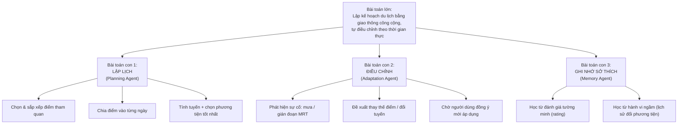
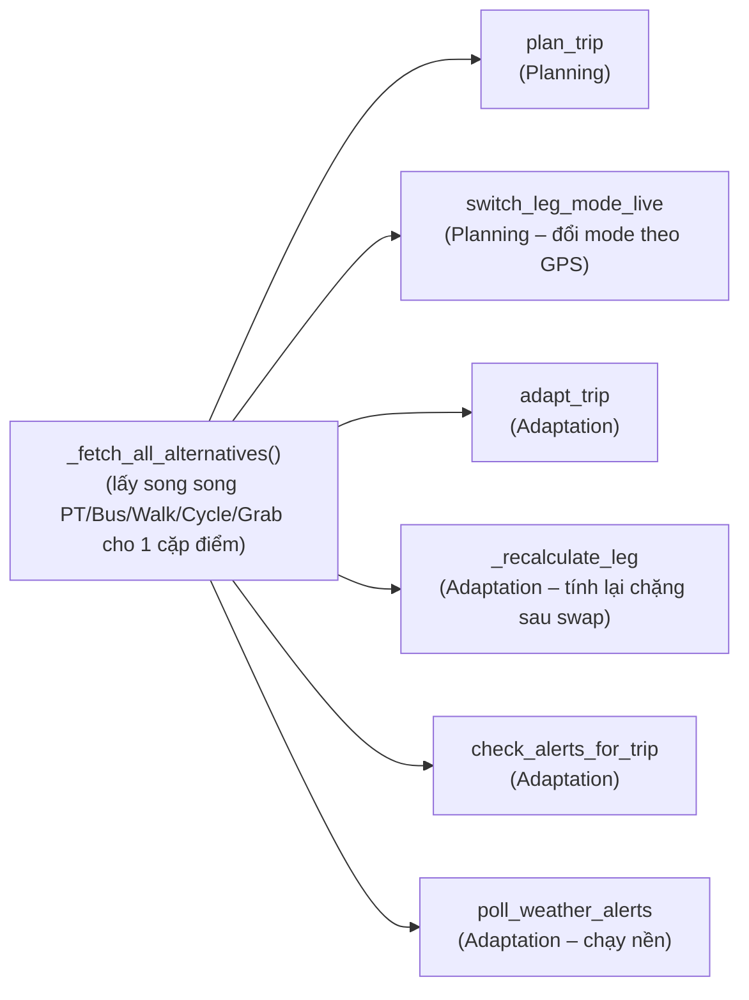
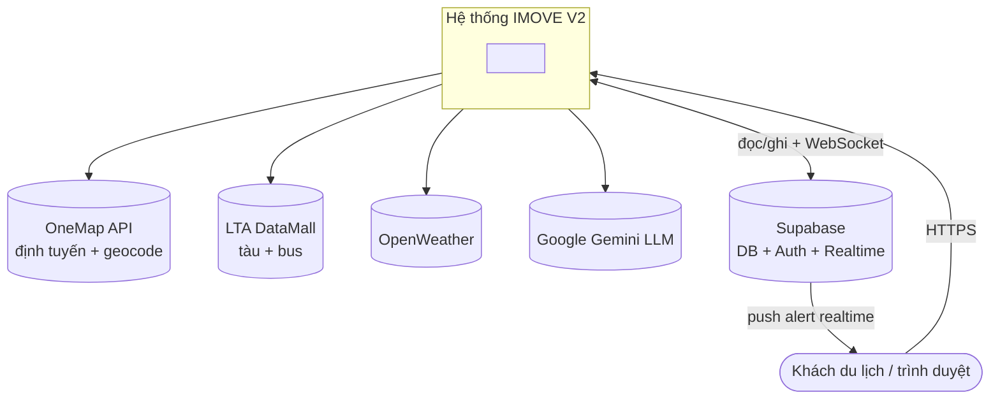
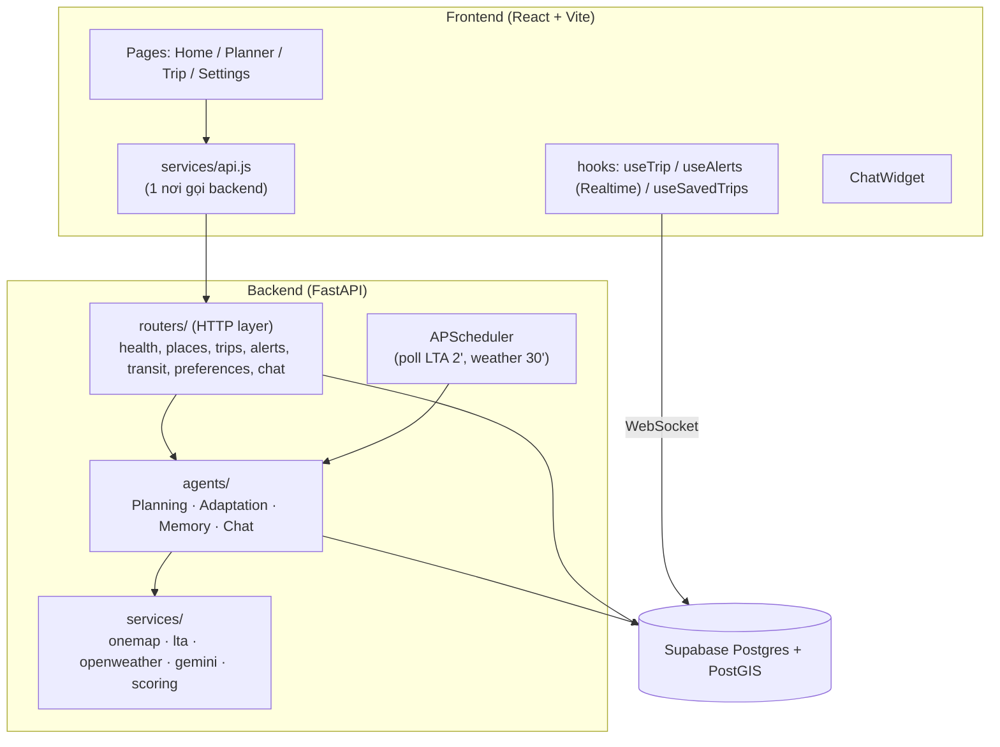
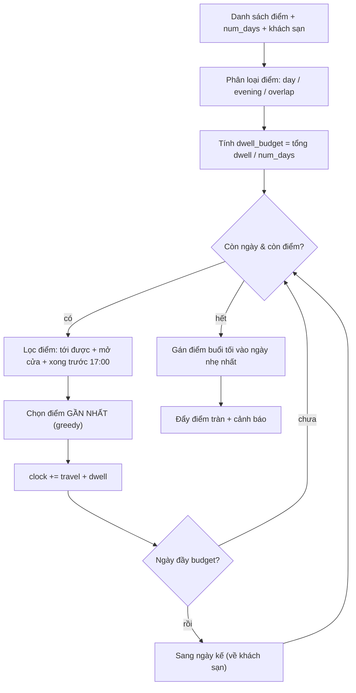
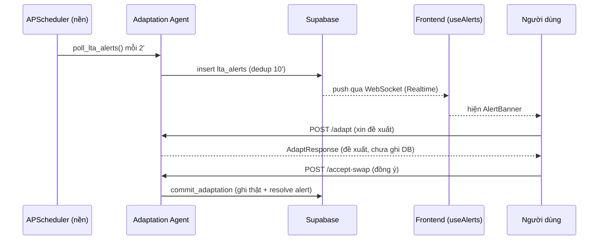
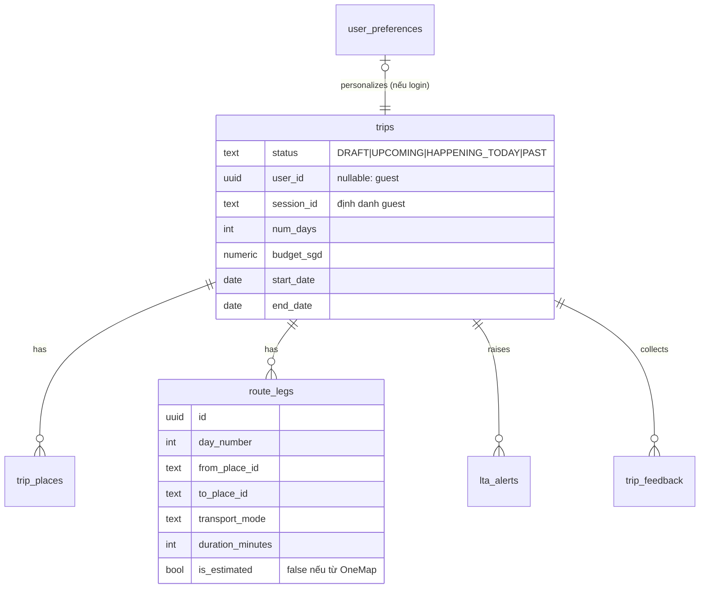

# IMOVE V2 — Phân rã kiến trúc & Tư duy tính toán (Breakdown)

> **Mục đích của tài liệu này.** Đây là *nguyên liệu* (raw material) để các thành viên trong nhóm — kể cả những người **không trực tiếp code** — hiểu ứng dụng hoạt động thế nào và viết được các phần của bài báo cáo môn *Computational Thinking* theo template.
>
> Tài liệu **không** phải là bài báo cáo hoàn chỉnh. Nó bỏ qua cover page và mọi vấn đề định dạng. Mỗi mục bên dưới được gắn nhãn `→ Dùng cho phần [X]` để bạn biết nó phục vụ phần nào trong template.
>
> Cách dùng nhanh: tìm phần template bạn được giao → đọc mục tương ứng → diễn giải lại bằng lời của bạn + chèn sơ đồ. Các sơ đồ viết bằng cú pháp **Mermaid** (GitHub render trực tiếp; nếu xuất PDF có thể chụp màn hình từ GitHub hoặc mermaid.live).

---

## 0. Bản đồ: mục nào phục vụ phần nào của template

| Phần trong template báo cáo | Đọc mục nào trong tài liệu này |
|---|---|
| Idea (Problem / Vision / Target Users) | §1 |
| Problem Analysis & Decomposition | §2 |
| System Overview (Stakeholders, Actors, Core Features, Innovation) | §3 |
| Pattern Recognition | §4 |
| Abstraction | §5 |
| System / Algorithm Design (FE/BE/DB/AI, C4, sơ đồ) | §6 |
| Implementation (challenges & solutions) | §7 |
| Testing | §8 |
| Demo | §9 |
| Deployment | §10 |
| Bảng tra cứu nhanh "CT pillar → bằng chứng trong code" | §11 |
| Thuật ngữ | §12 |

---

## 1. Ý tưởng (Idea)
> → Dùng cho phần **Idea**

### 1.1 Problem Statement (Phát biểu vấn đề)
Khách du lịch đến Singapore muốn dùng **giao thông công cộng** (MRT/bus) để đi tham quan, nhưng gặp 3 khó khăn:

1. **Lập lịch thủ công rất mệt.** Phải tự tra cứu giờ mở cửa, thời gian di chuyển giữa các điểm, chia điểm tham quan ra từng ngày sao cho hợp lý (không nhồi nhét, không lãng phí).
2. **Không biết chọn phương tiện nào.** Giữa MRT, bus, đi bộ, xe đạp, Grab — cái nào nhanh hơn / rẻ hơn / ít đi bộ hơn phụ thuộc vào từng chặng và vào sở thích cá nhân.
3. **Kế hoạch "chết cứng" khi có sự cố.** Trời mưa (Singapore mưa bất chợt) làm hỏng các điểm ngoài trời; MRT bị gián đoạn làm hỏng cả chuỗi di chuyển. Các app lập lịch thông thường không tự điều chỉnh.

### 1.2 Product Vision (Tầm nhìn sản phẩm)
Một **trợ lý lập kế hoạch chuyến đi đa tác tử (multi-agent)**: người dùng chỉ cần chọn vài địa điểm + số ngày + ngân sách; hệ thống tự **lập lịch tối ưu**, **gợi ý phương tiện theo sở thích**, và **chủ động điều chỉnh** khi thời tiết/giao thông thay đổi trong lúc đi thực tế.

### 1.3 Target Users (Người dùng mục tiêu)
- **Khách du lịch nước ngoài** đến Singapore (chính), ưu tiên giao thông công cộng.
- Hỗ trợ **song ngữ Việt – Anh** (xem `LanguageContext`, chatbot tự nhận diện ngôn ngữ).
- **Không bắt buộc đăng nhập**: khách (guest) dùng được toàn bộ tính năng lập lịch & điều chỉnh; chỉ tính năng *ghi nhớ sở thích* (Memory Agent) mới cần tài khoản.

---

## 2. Phân tích & Phân rã vấn đề (Problem Analysis & Decomposition)
> → Dùng cho phần **Problem Analysis and decomposition**
> Đây là phần **lõi** của tư duy tính toán: chia bài toán lớn không giải được thành các bài toán con giải được.

### 2.1 Phân rã theo *bài toán nghiệp vụ*
Bài toán gốc "lập kế hoạch du lịch tự điều chỉnh" được tách thành **3 trách nhiệm độc lập**, mỗi trách nhiệm là một **Agent** (tác tử):



> Một **Agent thứ 4 — Chat Agent** được bổ sung sau (trợ lý hội thoại) đóng vai *giao diện ngôn ngữ tự nhiên* gọi lại các tác tử trên. Xem §3.3 và §6.6.

### 2.2 Phân rã theo *tầng kỹ thuật* (separation of concerns)
Mỗi tầng chỉ làm đúng một việc, gọi xuống tầng dưới — đây là dạng phân rã theo **kiến trúc phân lớp**:

```
HTTP request
   │
   ▼
routers/      ← Chỉ xử lý HTTP: nhận request, kiểm tra quyền, trả lỗi.  KHÔNG chứa logic nghiệp vụ.
   │
   ▼
agents/       ← Logic nghiệp vụ (75% rule-based code): lập lịch, điều chỉnh, ghi nhớ.
   │
   ▼
services/     ← Vỏ bọc các API ngoài: OneMap (định tuyến), LTA (tàu/bus), OpenWeather, Gemini (LLM).
   │
   ▼
models/       ← Định nghĩa cấu trúc dữ liệu (Pydantic) dùng chung cho mọi tầng.
```

Quy tắc gọi (chứng minh sự tách bạch — trích từ code thật):
- `routers/places.py` → `services/onemap.py` (tra cứu/geocode, không cần agent).
- `routers/trips.py` → `agents/planning_agent.py` → `services/onemap.py` + `services/gemini.py`.
- `routers/alerts.py` & scheduler → `agents/adaptation_agent.py` → `services/lta.py` + `services/openweather.py`.

### 2.3 Phân rã bài toán *lập lịch* thành 8 bước con
Hàm trung tâm `planning_agent.plan_trip()` (file `backend/app/agents/planning_agent.py`) giải bài toán lập lịch bằng cách chia thành chuỗi bước con đánh số sẵn trong code. Mỗi bước được gắn nhãn `[CODE]` (giải bằng quy tắc) hay `[LLM]` (giải bằng AI):

| Bước | Việc làm | Loại | Vì sao tách ra |
|---|---|---|---|
| 1 | Xác thực `place_ids`; nếu không nhận ra → nhờ Gemini đoán tên | `[CODE]`+`[LLM]` | Tách "dữ liệu sạch" khỏi "dữ liệu mơ hồ do người gõ" |
| 2+4 | Chia điểm vào ngày bằng **greedy theo quỹ thời gian** (`_day_bucketed_greedy`) | `[CODE]` | Bài toán xếp lịch theo cửa sổ thời gian |
| 3 | Lấy tuyến cho mọi cặp điểm liền kề (song song) | `[CODE]` | Tách I/O mạng ra khỏi logic xếp lịch |
| 5 | Phát hiện ngày quá tải/quá rảnh → nhờ Gemini viết cảnh báo thân thiện | `[LLM]` | Ngôn ngữ tự nhiên là việc của LLM, không phải quy tắc |
| 6 | Dựng các *leg* (chặng) + tính giờ đến/đi từng điểm | `[CODE]` | Bài toán mô phỏng dòng thời gian |
| 6b | Gom các đoạn di chuyển dài → nhờ Gemini viết thông báo gợi ý | `[LLM]` | |
| 7 | Kiểm tra ngân sách → cảnh báo (không chặn) | `[CODE]` | |
| 8 | (Không gọi LLM — sở thích đã có cấu trúc rõ ràng) | `[CODE]` | |

> **Điểm CT đắt giá để nhấn mạnh trong báo cáo:** việc chia "phần giải được bằng quy tắc" (deterministic, rẻ, kiểm thử được) khỏi "phần cần AI" (mơ hồ, đắt, có rate-limit) chính là **decomposition theo độ chắc chắn của lời giải** — và đó là lý do ràng buộc **75% code / 25% LLM** tồn tại.

---

## 3. Tổng quan hệ thống (System Overview)
> → Dùng cho phần **System Overview**

### 3.1 Main Stakeholders (Các bên liên quan)
| Bên liên quan | Quan tâm điều gì |
|---|---|
| Khách du lịch (end-user) | Lịch trình hợp lý, dễ đi, tự điều chỉnh |
| Nhóm phát triển (sinh viên) | Kiến trúc rõ ràng, kiểm thử được, đúng ràng buộc môn học |
| Nhà cung cấp dữ liệu (LTA, OneMap, OpenWeather, Google/Gemini) | Được gọi đúng hạn mức (rate limit), đúng điều khoản |
| Giảng viên & TA | Thể hiện rõ tư duy tính toán |

### 3.2 Main Actors (Các loại người dùng/tác nhân)
- **Guest (khách chưa đăng nhập):** lập lịch, điều chỉnh, đổi phương tiện — không lưu sở thích.
- **Authenticated user (đã đăng nhập):** mọi thứ của guest + lưu/đồng bộ chuyến đi + Memory Agent học sở thích.
- **Tác nhân tự động (system actor):** `APScheduler` chạy nền — poll cảnh báo MRT mỗi 2 phút, poll thời tiết mỗi 30 phút (xem `main.py` lifespan).

### 3.3 List of Core Features (Tính năng cốt lõi)
1. **Lập lịch tự động** nhiều ngày từ danh sách điểm + ngân sách + khách sạn làm điểm neo.
2. **Gợi ý điểm bằng AI** theo sở thích/loại nhóm (`/places/ai-suggest` → Gemini).
3. **Chọn phương tiện thông minh** cho từng chặng bằng *chấm điểm đa tiêu chí có trọng số* (xem §6.5).
4. **So sánh phương tiện** (MRT / Bus / Walk / Cycle / Grab) ngay trên UI, kèm deeplink mở app Grab.
5. **Đổi phương tiện** ở chế độ kế hoạch (dùng cache) và **đổi trực tiếp theo GPS** khi đang đi ("I'm lost").
6. **Điều chỉnh chủ động:**
   - *Mưa:* tự đề xuất đổi điểm ngoài trời → điểm trong nhà gần nhất.
   - *Gián đoạn MRT:* tự định tuyến lại chặng MRT sang bus.
7. **Cảnh báo thời gian thực** đẩy về trình duyệt qua **Supabase Realtime (WebSocket)**, không polling phía client.
8. **Giờ xe bus thực tế** từ LTA (đếm ngược chuyến kế tiếp).
9. **Trợ lý hội thoại (Chatbot)** song ngữ, sửa lịch trình bằng *quy trình hai bước (đề xuất → xác nhận)*.
10. **Ghi nhớ & học sở thích** (Memory Agent) cho người đã đăng nhập.

### 3.4 Innovation Highlights (Điểm sáng tạo)
- **Kiến trúc đa tác tử có ràng buộc 75/25:** quyết định *deterministic* dùng code, chỉ dùng LLM ở mép (edge) — vừa rẻ vừa kiểm thử được.
- **"Không có ước lượng giả" (No fallback estimates):** mọi lỗi API ngoài đều ném exception có kiểu (`NoRouteError`, `LTAUnavailableError`, `WeatherUnavailableError`) → hệ thống không bịa số liệu sai. (Lưu ý: trên đường *non-optimize*, hệ thống dùng ước lượng haversine **được đánh dấu rõ** `is_estimated=True` để UI hiển thị, chứ không trộn lẫn với số liệu thật.)
- **Quy trình "đồng thuận người dùng" (User Consent Flow):** Adaptation Agent và Chat Agent **không bao giờ tự sửa** lịch — luôn tạo *đề xuất* và chờ người dùng bấm chấp nhận.
- **Mô hình giá Grab tự xây** khi OneMap không có chế độ lái xe (công thức theo bảng giá Grab Singapore 2026).

---

## 4. Nhận diện mẫu (Pattern Recognition)
> → Dùng cho phần **Pattern Recognition**
> CT pillar này = "tìm những thứ lặp lại để giải một lần, dùng nhiều nơi".

### 4.1 Mẫu lặp ở tầng kiến trúc
| Mẫu được nhận ra | Lặp ở đâu | Giải một lần bằng |
|---|---|---|
| "Mọi lời gọi API ngoài đều có thể fail" | OneMap, LTA, OpenWeather, Gemini | Mỗi service ném 1 exception có kiểu riêng; tầng trên bắt và xử lý mềm |
| "Mọi handler trip đều phải nạp plan từ cache → DB → 404" | Hầu hết endpoint trong `routers/trips.py` | Cùng một đoạn `_trip_store.get → _fetch_trip_from_db → raise 404` |
| "Mọi thao tác sửa lịch = lập lại lịch" | add_place, remove_place, reorder, remove_day, optimize | Đều gọi lại `plan_trip(...)` với danh sách điểm mới thay vì viết logic riêng |
| "Mọi nguồn cảnh báo ghi vào cùng 1 chỗ" | LTA train, weather, proximity | Đều `insert` vào bảng `lta_alerts` với cùng cơ chế **dedup 10 phút** |

### 4.2 Mẫu quan trọng nhất: **một primitive định tuyến dùng lại khắp nơi**
GitNexus (công cụ phân tích đồ thị code) cho thấy hàm `_fetch_all_alternatives()` là **điểm tái sử dụng tới hạn (CRITICAL)** — nếu sửa nó sẽ ảnh hưởng **6 luồng thực thi** trên **cả 2 agent**:



> **Ý nghĩa CT:** thay vì mỗi tính năng tự gọi OneMap theo cách riêng, nhóm nhận ra mẫu chung "lấy mọi phương tiện khả dĩ cho một cặp toạ độ" và trừu tượng hoá thành **một hàm duy nhất**. Đây là pattern recognition dẫn thẳng tới abstraction (§5).

### 4.3 Mẫu trong dữ liệu / nghiệp vụ
- **Khách sạn = điểm neo:** mỗi ngày bắt đầu và kết thúc ở khách sạn → mẫu "round-trip theo ngày" được mã hoá trong `_day_bucketed_greedy`.
- **Phân loại điểm theo cửa sổ thời gian:** mọi điểm rơi vào 1 trong 3 mẫu `day / evening / overlap` (`_classify_place`) → điểm tối (vd chợ đêm) luôn được gán sau cùng để cân bằng ngày.
- **Giờ cao điểm & mưa lặp lại theo ngữ cảnh:** mẫu này được gói trong `ContextSnapshot` (peak: 7:30–9:30 & 17:00–20:00; mưa: light ≥2.5mm/h, heavy ≥7.5mm/h) và tự động đổi trọng số chấm điểm.

---

## 5. Trừu tượng hoá (Abstraction)
> → Dùng cho phần **Abstraction**
> CT pillar này = "ẩn chi tiết phức tạp sau một giao diện đơn giản".

### 5.1 Các tầng trừu tượng chính
| Trừu tượng | Ẩn đi điều gì phức tạp | Lộ ra giao diện đơn giản gì |
|---|---|---|
| **Agent** | Toàn bộ thuật toán xếp lịch/điều chỉnh | `plan_trip(...)`, `adapt_trip(...)` |
| **Service** | Chi tiết HTTP, token, định dạng JSON kỳ quặc của API ngoài | `get_route()`, `get_train_alerts()`, `get_forecast()` |
| **Model (Pydantic)** | Việc kiểm tra & ép kiểu dữ liệu | Các class `TripPlan`, `LegResponse`, `AlternativeRoute`… |
| **`AlternativeRoute`** | Khác biệt giữa MRT/Bus/Walk/Cycle/Grab | 4 con số chung: `duration, cost, walk, transfers` |
| **`ContextSnapshot`** | "Bây giờ là giờ cao điểm? Có mưa không?" | 2 property: `is_peak_hours`, `rain_level` |
| **`UserPreferenceProfile`** | Sở thích người dùng | 4 trọng số (sum = 1.0) + ràng buộc mềm/cứng |

### 5.2 Trừu tượng "đắt" nhất: biến **mọi phương tiện** thành **4 con số**
Để so sánh được MRT, bus, đi bộ, xe đạp, Grab với nhau, hệ thống *bỏ qua* mọi chi tiết riêng và **rút gọn mỗi lựa chọn về 4 chiều đo chuẩn hoá**:

```
Bất kỳ phương tiện nào  ──abstraction──►  { duration_minutes, cost_sgd, walk_minutes, num_transfers }
```

Nhờ đó hàm chấm điểm `score_alternatives()` không cần biết "MRT là gì" — nó chỉ làm việc trên 4 con số. Đây là abstraction cho phép thuật toán so sánh *tổng quát hoá* cho mọi phương tiện hiện có lẫn tương lai.

### 5.3 Trừu tượng hành vi: "sửa lịch" = "lập lại lịch"
Người dùng thấy nhiều thao tác khác nhau (thêm điểm, xoá điểm, đổi thứ tự, thêm/bớt ngày). Bên dưới, tất cả **trừu tượng về cùng một phép toán**: dựng lại danh sách `place_ids` mới rồi gọi lại `plan_trip()`. Điều này biến N tính năng thành 1 thuật toán + N phép biến đổi danh sách nhỏ.

### 5.4 Trừu tượng "thời gian một ngày" thành trục phút
Mọi tính toán lịch quy về **số phút kể từ 00:00**: ngày bắt đầu 09:00 = `540`, kết thúc mềm 17:00 = `1020`, kết thúc cứng 17:30 = `1050`. Giờ mở cửa "HH:MM-HH:MM" cũng được parse về `(open_min, close_min)`. Nhờ trừu tượng này, "điểm có mở cửa lúc mình tới không?" trở thành phép so sánh số học đơn giản.

---

## 6. Thiết kế hệ thống & thuật toán (System / Algorithm Design)
> → Dùng cho phần **System / Algorithm Design** (gợi ý dùng mô hình C4 như template yêu cầu)

### 6.1 Technical Stack
| Tầng | Công nghệ | Vai trò |
|---|---|---|
| **Frontend (FE)** | React 18 + Vite, React Router, Tailwind/shadcn-style UI, Leaflet (bản đồ) | Wizard lập lịch nhiều bước, bản đồ, realtime alert UI, chatbot |
| **Backend (BE)** | Python + FastAPI, APScheduler (job nền), httpx (async HTTP) | API + 4 agent + scheduler |
| **Database/Auth/Realtime (DB)** | Supabase (PostgreSQL + PostGIS, Auth, Realtime WebSocket, RLS) | Lưu trip/legs/alerts/preferences; đẩy cảnh báo realtime; tìm điểm trong nhà gần nhất bằng PostGIS |
| **AI** | Google Gemini 2.5 Flash (qua API key hoặc Vertex AI) | Parse ngôn ngữ tự nhiên, gợi ý điểm, viết cảnh báo, chatbot function-calling |
| **API dữ liệu ngoài** | OneMap (định tuyến + geocode SG), LTA DataMall (cảnh báo tàu + giờ bus), OpenWeather | Nguồn dữ liệu thật |

### 6.2 C4 — Level 1: Context Diagram


### 6.3 C4 — Level 2: Container Diagram


> **Ghi chú độ chính xác cho người viết báo cáo:** CLAUDE.md (tài liệu cũ) viết "3 agents" và "4 routers"; *thực tế trong code hiện tại* có **4 agent** (thêm Chat Agent) và `main.py` đăng ký **7 router** (health, places, trips, alerts, transit, preferences, chat). Nên trích theo code thật.

### 6.4 Thuật toán lập lịch — Greedy theo quỹ thời gian (`_day_bucketed_greedy`)
**Bài toán:** chia/sắp xếp danh sách điểm vào `num_days` ngày sao cho mỗi ngày khả thi trong cửa sổ 09:00–17:00, tôn trọng giờ mở cửa, và **không nhồi hết vào ngày 1**.

**Ý tưởng cốt lõi:**
1. Tính tổng thời gian lưu lại (`dwell`) của mọi điểm ban ngày, chia đều cho số ngày → `dwell_budget` mỗi ngày.
2. Với mỗi ngày, bắt đầu ở khách sạn lúc 09:00, lặp:
   - Lọc các điểm **tới được + còn mở cửa + xong trước 17:00** (ước lượng thời gian đi bằng haversine, tốc độ MRT-bias `0.25 km/phút`, tối thiểu 10 phút/chặng).
   - Chọn điểm **gần nhất** với vị trí hiện tại (greedy theo khoảng cách).
   - Cộng thời gian đi + dwell vào đồng hồ ngày; ngày (trừ ngày cuối) **dừng nhận** khi đã đạt `dwell_budget`.
3. Điểm **buổi tối** được gán *sau cùng* vào ngày có tổng dwell nhỏ nhất (cân bằng) — `_assign_evening_to_days`.
4. Điểm tràn (không vừa ngày nào) được đẩy vào ngày nhẹ nhất + thêm cảnh báo.



> **Vì sao greedy mà không tối ưu toàn cục (TSP)?** Đây là quyết định thiết kế đáng nêu: với 2–8 điểm/ngày của khách du lịch, greedy "gần nhất" cho kết quả đủ tốt, **chạy tức thì** và **dễ giải thích** — phù hợp ràng buộc rate-limit và trải nghiệm realtime. (Ước lượng haversine chỉ dùng để *xếp lịch*; tuyến thật do OneMap trả về ở bước sau.)

### 6.5 Thuật toán chọn phương tiện — Chấm điểm đa tiêu chí có trọng số (`score_alternatives`)
**Bài toán:** với một chặng, có nhiều phương tiện khả dĩ — chọn cái "tốt nhất" theo sở thích người dùng *và* ngữ cảnh hiện tại.

**Các bước:**
1. **Lọc ràng buộc cứng:** bỏ bus nếu `avoid_bus`, bỏ metro nếu `avoid_metro`.
2. **Rút mỗi phương tiện về 4 chiều:** `duration, cost, walk_minutes, num_transfers` (xem abstraction §5.2).
3. **Chuẩn hoá tương đối trong nội bộ tập lựa chọn** (lower = better):
   `score_d = 1 − (val − min) / (max − min)`; nếu mọi mode bằng nhau → 1.0 (trung lập).
4. **Điều chỉnh trọng số theo ngữ cảnh** (`_effective_weights`):
   - Mưa to → mượn trọng số từ *đi bộ* sang *thời gian/chi phí*.
   - Giờ cao điểm → tăng trọng số *ít chuyển tuyến*.
   - Ràng buộc mềm `minimize_walking` / `minimize_fee` → cộng +0.15 vào chiều liên quan.
   - Cuối cùng **re-normalize tổng = 1.0**.
5. **Tính điểm có trọng số** + phạt mềm −0.30 nếu `avoid_transfers` và >1 lần chuyển.
6. Sắp xếp giảm dần → `recommended_mode` + chuỗi *reasoning* để hiển thị.

```
score(mode) = w_dur·N(duration) + w_cost·N(cost) + w_walk·N(walk) + w_xfer·N(transfers)
            (N = chuẩn hoá min-max đảo chiều; w = trọng số đã điều chỉnh theo ngữ cảnh, Σw=1)
```

> **Lưu ý nghiệp vụ trong code:** sau khi chấm điểm còn có *safety guard*: chặng ≥1.5 km mà bị chọn WALK → ưu tiên đổi sang MRT/Bus; ≥2 km mà không có phương tiện công cộng → đề xuất Grab. GRAB **không** tham gia chấm điểm, chỉ được chọn qua guard khoảng cách này.

### 6.6 Thuật toán điều chỉnh (Adaptation) — 100% rule-based, có "đồng thuận"
Hai kịch bản chính:

**(a) Mưa → đổi điểm ngoài trời sang trong nhà** (`_apply_weather_swap`)
- Tìm điểm trong nhà gần nhất trong bán kính 5 km, **ưu tiên gọi PostGIS RPC `find_nearest_indoor`** (1 truy vấn DB, có kiểm tra giờ mở cửa trong DB); nếu Supabase lỗi → *fallback* quét haversine trên JSON cục bộ.
- Chống trùng: không cho 2 điểm ngoài trời swap về cùng 1 điểm trong nhà, không gợi ý điểm người dùng đã có.
- Tính lại các chặng bị ảnh hưởng (`_recalculate_leg`).

**(b) Gián đoạn MRT → định tuyến lại sang bus** (`_reroute_mrt_legs`, "post-filter + retry")
1. Gọi OneMap PT bình thường (có thể OTP đã tự tránh tuyến lỗi).
2. *Hậu kiểm* các sub-leg: nếu vẫn dùng tuyến bị lỗi (so prefix mã tuyến: EW, NS, CC…) → gọi lại ép `transit_modes="BUS"`.
3. Nếu bus cũng không có → giữ chặng cũ + đánh dấu `is_estimated=True` để UI cảnh báo.

**Cơ chế chạy:** `APScheduler` poll LTA mỗi 2 phút & thời tiết mỗi 30 phút → `insert` vào `lta_alerts` (có **dedup 10 phút**). Người dùng nhận cảnh báo qua Realtime; khi bấm "adapt" hệ thống tạo *đề xuất* (`_pending_swaps`) và **chỉ ghi DB sau khi người dùng bấm accept-swap** (`commit_adaptation`).



### 6.7 Thuật toán Memory Agent — học sở thích
- **Tường minh:** lưu `rating`/`comment` vào `trip_feedback`.
- **Ngầm định:** mỗi lần đổi phương tiện, router ghi 1 feedback `implicit` ("BUS → METRO"…). Khi quét thấy **≥2** lần "BUS → MRT" → bật `prefer_mrt`; **≥2** lần "→ WALK" → tăng `max_walk_minutes += 5`. Ngưỡng `_IMPLICIT_CHANGE_THRESHOLD = 2`.
- Chỉ hoạt động khi đã đăng nhập (cần `user_id` hợp lệ dạng UUID).

### 6.8 Chat Agent — function-calling 2 bước (đề xuất → xác nhận)
- Tự lái vòng lặp gọi công cụ của Gemini **trong tiến trình** (tắt automatic function calling) — tối đa `_MAX_TURNS = 4`.
- **READ tools** (`get_current_trip`, `search_places`, `compare_routes`, `get_bus_arrivals`, `get_weather`…) chạy ngay, trả kết quả lại cho model.
- **WRITE tools** (`add_place`, `remove_place`, `change_leg_mode`, `optimize_trip`…) **không bao giờ tự sửa** — chỉ tạo *pending action* + bản xem trước; người dùng phải gọi `/chat/confirm` thì mới thực thi qua đúng các handler trip.
- Bảo mật: bắt buộc đăng nhập; nếu người dùng nhắc trip theo tên → buộc gọi `list_my_trips(name_filter=...)` trước.

### 6.9 Mô hình dữ liệu (DB) rút gọn

- **Vòng đời trip (state machine):** `DRAFT → UPCOMING → HAPPENING_TODAY → PAST`, suy ra từ `start_date`+`num_days` (FE: `computeTripStatus`; scheduler chỉ poll trip `HAPPENING_TODAY`).
- **Hai chế độ chạy của backend:** có Supabase → lưu DB; không có Supabase → fallback bộ nhớ (`_trip_store`, `_trip_meta`) để demo offline vẫn chạy.
- **Bảo mật:** RLS theo `user_id`/`session_id`; quyền sở hữu được kiểm tra ở router (`_verify_user_ownership`, `_verify_session_ownership`).

---

## 7. Hiện thực: thách thức & giải pháp (Implementation)
> → Dùng cho phần **Implementation**

| Thách thức | Vì sao khó | Giải pháp trong code |
|---|---|---|
| **Rate limit của Gemini (≤15 RPM)** | Nhiều coroutine gọi đồng thời dễ vượt hạn mức | `_rate_limit()` dùng lock chỉ để *đặt chỗ slot* (`_last_call_at`), rồi `sleep` **ngoài** lock → không xếp hàng dồn. Chế độ Vertex bỏ qua guard |
| **Độ trễ khi gọi OneMap cho nhiều cặp điểm** | Mỗi cặp 1 HTTP request, lập lịch có nhiều cặp | `asyncio.gather` lấy **song song** tất cả phương tiện cho tất cả cặp (`_fetch_all_alternatives`) |
| **Người dùng thêm/bớt điểm liên tục** | Gọi OneMap mỗi lần sẽ chậm & tốn quota | Đường *non-optimize* dùng ước lượng haversine tức thì (`is_estimated=True`); chỉ khi bấm **Optimize** mới lấy tuyến thật |
| **Tránh gọi lại API cho cặp đã biết** | Optimize lại toàn bộ tốn kém | `existing_real_legs` được nạp sẵn vào cache (`alt_cache`/`route_cache`) để bỏ qua |
| **OneMap không có chế độ "drive" cho Grab** | Thiếu dữ liệu giá/tuyến Grab | Tự xây mô hình giá `_grab_fare` theo bảng giá SG 2026; fallback haversine khi cả drive cũng fail |
| **Cảnh báo bị lặp** | Poll mỗi 2' dễ tạo alert trùng | **Dedup 10 phút** ở backend + `dedupe()` theo `alert_type` ở `useAlerts.js` |
| **Tên tuyến bus chứa mã MRT gây nhầm** | "Bugis Stn Exit B EW12" trông như tuyến EW | `_leg_uses_disrupted_line` kiểm `mode=="METRO"` **trước** rồi mới xét prefix (short-circuit) |
| **Mất dữ liệu sau khi server restart** | Cache bộ nhớ biến mất | `_fetch_trip_from_db` dựng lại `TripPlan` đầy đủ (kể cả polyline, sub_legs) từ DB; coerce mã cũ "MRT"→"METRO" |
| **Hàng "ma" sau nhiều lần re-plan** | Insert chồng lên dữ liệu cũ | `_persist_trip_plan` **xoá sạch rồi insert lại** mỗi lần |
| **Múi giờ** | Singapore khác UTC | Dùng `ZoneInfo("Asia/Singapore")` cho giờ định tuyến/giờ mở cửa |

---

## 8. Kiểm thử (Testing)
> → Dùng cho phần **Testing**

### 8.1 Chiến lược test
- **Backend:** `pytest` theo từng tầng — `tests/test_services`, `tests/test_agents`, `tests/test_routers`. (GitNexus thống kê các cụm test lớn: `Test_agents`, `Test_services`, `Test_routers`, `Test_scripts`.)
  - Chạy tất cả: `cd backend && pytest tests/ -v`
  - Một module: `cd backend && pytest tests/test_services/test_onemap.py -v`
- **Frontend:** `vitest` — thư mục `frontend/src/__tests__/` phủ hooks (`useAlerts`, `useTrip`, `useSavedTrips`), pages (`Planner`, `Trip`), components planner/map/auth, và `lib/tripUtils`.
  - Chạy: `cd frontend && npm test`

### 8.2 Vì sao kiến trúc này *dễ test* (điểm CT đáng nêu)
- Logic nghiệp vụ là **hàm thuần (deterministic)** → test không cần gọi mạng thật. `score_alternatives`, `_day_bucketed_greedy`, `_distribute_days`, `computeTripStatus` đều test bằng input/output cố định.
- Ràng buộc 75/25 nghĩa là **75% code kiểm thử được bằng đơn vị**; phần LLM (25%) được cô lập sau service nên có thể *mock*.
- Các điểm fallback (Supabase=None, OneMap fail) được thiết kế tường minh → viết được test cho "đường lỗi".

### 8.3 Gợi ý bảng test-case cho báo cáo (mẫu)
| Tính năng | Test case | Kỳ vọng |
|---|---|---|
| Chấm điểm phương tiện | 3 mode cùng dữ liệu | tất cả `score_d = 1.0`, không crash |
| Lập lịch | tổng dwell > 1 ngày | chia ra ≥2 ngày, không dồn ngày 1 |
| Giờ mở cửa | điểm đóng cửa lúc tới | bị loại / đẩy sang ngày khác |
| Đổi mode khi ngân sách vượt | cost > budget | trả `warnings` (không chặn) |
| Adaptation mưa | có điểm ngoài trời + mưa>70% | sinh đề xuất swap, **chưa** ghi DB |
| Realtime alert | insert lta_alerts | FE nhận qua WebSocket, dedup theo type |

> Lưu ý: file `To_fix.md` / `improve.md` ở repo là nhật ký lỗi/cải tiến — có thể trích cho mục *Bug reports / Improvement*.

---

## 9. Demo
> → Dùng cho phần **Demo** (chỉ là gợi ý ảnh chụp; nhóm tự chèn screenshot + link YouTube)

Các màn hình nên chụp (theo `frontend/src/pages` & `components`):
1. **Home** — danh sách chuyến đã lưu + trạng thái (Upcoming/Today/Past).
2. **Planner (wizard 4 bước)** — chọn khách sạn, lọc điểm theo loại, đặt giờ bắt đầu ngày, panel payload API.
3. **Trip — tab List** — timeline từng ngày, từng chặng, badge phương tiện, nút Optimize.
4. **Trip — tab Map** — polyline tuyến (Leaflet), pin khách sạn/điểm.
5. **So sánh phương tiện** (CitymapperTransitCard) + deeplink Grab.
6. **AlertBanner** — cảnh báo mưa/MRT realtime + nút đề xuất điều chỉnh.
7. **ChatWidget** — hỏi đáp song ngữ + xác nhận đề xuất sửa lịch.
8. **Bus arrivals** — đếm ngược chuyến bus thực tế.

---

## 10. Triển khai (Deployment)
> → Dùng cho phần **Deployment**

- **Backend** dự kiến chạy trên **Render (free tier)** — máy chủ *ngủ đông sau 15 phút* nên có endpoint `GET /health` để ping giữ sống.
- **Frontend** build tĩnh bằng Vite (`npm run build`), trỏ `VITE_API_BASE_URL` về backend; khi rỗng thì dùng Vite dev proxy (tránh CORS).
- **Cấu hình:** backend đọc `.env` trong `backend/` qua `pydantic_settings` (khoá OneMap/LTA/OpenWeather/Gemini/Supabase). Gemini có 2 chế độ: API key **hoặc** Vertex AI (service account).
- **CORS** cho `localhost:5173/5174` + `frontend_url` production.
- **Migrations** Supabase nằm trong `supabase/migrations/` (đánh số 001→015), bao gồm PostGIS cho tìm điểm trong nhà, RLS, vòng đời trip, làm giàu dữ liệu Google.

---

## 11. Bảng tra cứu nhanh: CT pillar → bằng chứng trong code
> → Dùng xuyên suốt; tiện cho các phần Decomposition / Pattern / Abstraction / Algorithm Design

| CT Pillar | Biểu hiện trong IMOVE | File / hàm để trích dẫn |
|---|---|---|
| **Decomposition** | Chia thành 4 agent + kiến trúc 4 tầng; `plan_trip` chia 8 bước con | `agents/*`, `routers/`, `services/`, `plan_trip` |
| **Pattern Recognition** | 1 primitive định tuyến dùng cho 6 luồng; mẫu "sửa lịch = lập lại lịch"; dedup alert | `_fetch_all_alternatives`, `routers/trips.py`, dedup 10' |
| **Abstraction** | Mọi phương tiện → 4 con số; `ContextSnapshot`; `AlternativeRoute`; thời gian → trục phút | `scoring.py`, `models/preferences.py`, `models/trip.py` |
| **Algorithm Design** | Greedy theo quỹ thời gian; chấm điểm đa tiêu chí có trọng số; post-filter+retry rerouting | `_day_bucketed_greedy`, `score_alternatives`, `_reroute_mrt_legs` |
| **Evaluation/Constraints** | 75/25 code-LLM; no-fake-estimates; rate-limit; user-consent | toàn hệ thống, `gemini.py`, `_pending_swaps` |

---

## 12. Thuật ngữ (Glossary)
| Thuật ngữ | Nghĩa trong dự án |
|---|---|
| **Agent (tác tử)** | Một module logic nghiệp vụ độc lập (Planning / Adaptation / Memory / Chat) |
| **Leg (chặng)** | Một đoạn di chuyển giữa 2 điểm bằng 1 phương tiện |
| **Dwell** | Thời gian dự kiến lưu lại ở một điểm tham quan (phút) |
| **PT** | Public Transport — giao thông công cộng (MRT + bus) |
| **OTP** | OpenTripPlanner — bộ máy định tuyến PT mà OneMap dùng |
| **PostGIS** | Tiện ích không gian địa lý của PostgreSQL (tìm điểm gần nhất) |
| **RLS** | Row-Level Security của Supabase (mỗi user chỉ thấy dữ liệu của mình) |
| **`is_estimated`** | Cờ đánh dấu số liệu là *ước lượng haversine* chứ không phải tuyến thật từ OneMap |
| **Optimize path / non-optimize path** | Đường lập lịch có gọi OneMap thật / đường chỉ ước lượng tức thì |
| **User Consent Flow** | Quy trình đề xuất → người dùng xác nhận → mới ghi thay đổi |
| **Anchor (điểm neo)** | Khách sạn — nơi mỗi ngày bắt đầu và kết thúc |

---

*Tài liệu phân rã dựa trên mã nguồn thực tế tại nhánh `main` và phân tích đồ thị code bằng GitNexus (4151 symbols, 7199 relationships, 209 execution flows). Khi viết báo cáo, hãy ưu tiên trích theo code thật nếu phát hiện khác biệt với tài liệu cũ.*
