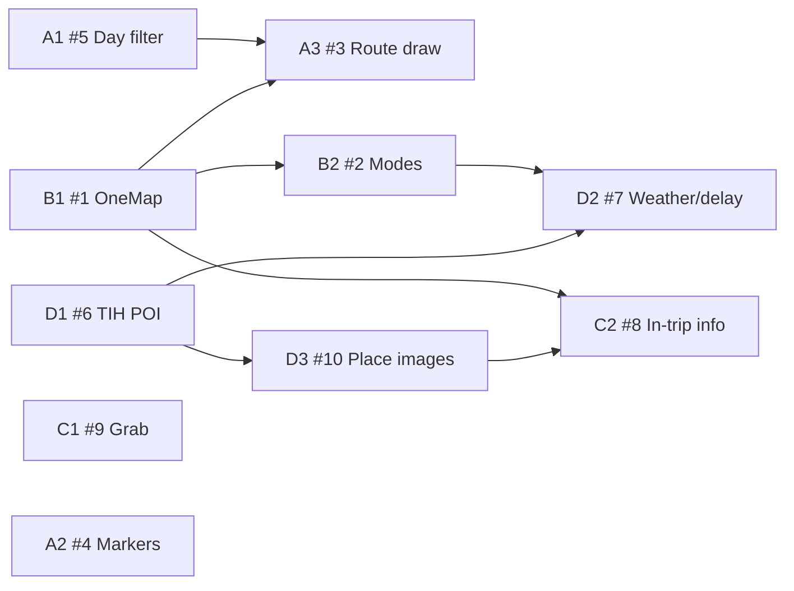

# Backlog — issues.md (10 mục)

**Status:** Draft — chờ duyệt trước khi implement  
**Nguồn:** `issues.md` (root repo)  
**Nguyên tắc sắp xếp:** Dễ trước → khó sau; quick wins trước khi đụng API/agent mới.

---

## Tổng quan thứ tự làm

| Wave | Mục | Độ khó ước lượng | Lý do ưu tiên |
|------|-----|------------------|---------------|
| **0 — Quick wins** | #5, #9, #4 (một phần), #10 (fallback UI) | 0.5–2 ngày | Chủ yếu frontend, ít rủi ro API |
| **1 — Nền dữ liệu & bản đồ** | #1 → #3, #4 (hoàn chỉnh) | 3–5 ngày | Sửa gốc OneMap + polyline |
| **2 — Tương tác hành trình** | #2, #8 | 3–4 ngày | Dựa trên API/UI đã có |
| **3 — Nền tảng & agent** | #6, #7, #10 (nguồn ảnh ổn định) | 1–2 tuần | TIH + pipeline ảnh + adaptation |

### Ánh xạ issues.md → ID backlog

| # issues.md | Mô tả ngắn | Epic |
|-------------|------------|------|
| 1 | OneMap — không bỏ field quan trọng | B1 |
| 2 | Đổi loại phương tiện | B2 |
| 3 | Vẽ route trên map đúng & đẹp | A3 |
| 4 | Đánh số thứ tự / marker | A2 |
| 5 | Filter map theo day1/day2 | A1 |
| 6 | POI từ TIH API Singapore | D1 |
| 7 | Logic thời tiết xấu & delay PT | D2 |
| 8 | Mô tả địa điểm khi đi + cảnh báo trễ | C2 |
| 9 | Grab deeplink | C1 |
| 10 | Ảnh minh họa địa điểm (thay Wiki URL hỏng) | D3 |

---

## Thứ tự thực thi (bảng tổng hợp)

| # | Task | issues | Files chính (dự kiến) | Risk |
|---|------|--------|------------------------|------|
| 1 | Lọc places theo ngày trên map | #5 | `pages/Trip.jsx`, `components/map/TripMap.jsx` | Low |
| 2 | Grab deep link (tách lib + hiện khi đang đi) | #9 | `lib/grabDeepLink.js`, `TransitSegment.jsx`, `ActiveLegFocus.jsx` | Low |
| 3 | Cải thiện marker số thứ tự (UI) | #4 | `components/map/TripMap.jsx`, `lib/tripUtils.js` | Low |
| 4 | Mở rộng parse OneMap | #1 | `services/onemap.py`, `models/trip.py`, routers | Medium |
| 5 | Vẽ route polyline đúng & đẹp | #3 | `TripMap.jsx`, `onemap.py` | Medium |
| 6 | Fix thứ tự marker nếu còn sai (sau #5) | #4 | `lib/tripUtils.js` | Low |
| 7 | Đổi phương tiện end-to-end | #2 | `TransitSegment.jsx`, `routers/trips.py`, `onemap.py` | Medium |
| 8 | Mô tả + cảnh báo trễ khi trip started | #8 | `ActiveLegFocus.jsx`, `PlaceCard.jsx`, alerts/LTA | Medium |
| 9 | Tích hợp TIH API POI | #6 | service mới, `places` search, Planner | High |
| 10 | Adaptation: xử lý weather/delay (không chỉ alert) | #7 | `adaptation_agent.py`, `AlertBanner.jsx` | High |
| 11 | Ảnh địa điểm — nguồn ổn định + backfill `image_url` | #10 | `data/places.json`, `models/place.py`, `PlaceCard.jsx`, script/tooling | Medium |

---

## Epic A — Map & hiển thị

### A1 — Lọc địa điểm theo ngày trên bản đồ (#5)

**Problem:** Tab Day 1/2 đã lọc `mapLegs` trong `Trip.jsx`, nhưng `TripMap` vẫn nhận `trip.places` (toàn bộ ngày).

**Fix:**
- Derive `mapPlaces` từ `from_place_id` / `to_place_id` trong `mapLegs` của tab/ngày hiện tại.
- Truyền `mapPlaces` vào `<TripMap places={...} legs={mapLegs} />`.

**Acceptance:**
- Chọn Day 2 → map chỉ marker + route của Day 2.
- Overview / Summary vẫn hiển thị tổng quan nếu tab tương ứng dùng `flatMap` legs (giữ hành vi hiện tại).

**Phụ thuộc:** Không.

---

### A2 — Cải thiện marker số thứ tự (#4)

**Problem:** `numberIcon(i+1)` trong `TripMap.jsx` — style chưa rõ, có thể lệch thứ tự nếu `buildOrderedPlaces` không khớp timeline.

**Fix (phase 1 — UI):** Redesign `DivIcon` (kích thước, font, viền, z-index, màu theo ngày hoặc mode).

**Fix (phase 2 — logic):** Sau A3/B1, kiểm tra `buildOrderedPlaces(places, legs)` khi legs đã lọc theo ngày.

**Acceptance:** Số 1…N khớp thứ tự panel trái; đọc rõ trên mobile.

**Phụ thuộc:** Nên làm cùng hoặc ngay sau A1.

---

### A3 — Vẽ route đúng & đẹp (#3)

**Problem:** Polyline decode lỗi → fallback đường thẳng; backend `_extract_pt_geometry` chỉ lấy geometry leg transit đầu tiên.

**Fix:**
- **Backend (B1):** Trả geometry đầy đủ hơn (nhiều leg / merged polyline nếu cần).
- **Frontend:** Vẽ từng segment theo `transport_mode`; tận dụng `MODE_STYLE` và legend có sẵn.

**Acceptance:** Route bám đường thực tế; không còn đoạn “cắt ngang” giữa các điểm PT.

**Phụ thuộc:** B1 (khuyến nghị làm B1 trước hoặc song song).

---

## Epic B — Backend OneMap & routing

### B1 — Mở rộng parse OneMap (#1)

**Problem:** `onemap.py` map một phần response OTP (duration, stopCode, `legGeometry` một leg, v.v.).

**Fix:** Lưu và expose thêm field hữu ích, ví dụ:
- Toàn bộ `legGeometry` / polyline per leg
- `distance`, fare, `numStops`, tên stop
- Timing / intermediate stops nếu API trả về

**Acceptance:** Response trip/leg đủ dữ liệu cho map, so sánh mode, ETA.

**Phụ thuộc:** Không — **unblocks A3, B2, C2.**

---

### B2 — Cho phép đổi loại phương tiện (#2)

**Hiện trạng:** `TransitSegment.jsx` có dropdown + `api.updateLeg`; Cycle (`apiMode: null`) chưa gọi API; lỗi có thể fail im lặng.

**Fix:**
- Wire đủ PT / Walk / Cycle qua `compareRoutes` + `updateLeg`.
- Re-plan leg sau đổi mode (geometry, duration, cost).
- Hiển thị lỗi rõ (`NoRouteError`, unavailable).

**Acceptance:** User đổi mode → leg + map cập nhật đúng.

**Phụ thuộc:** B1.

---

## Epic C — Trải nghiệm “đang đi”

### C1 — Grab deep link (#9)

**Hiện trạng:** `buildGrabDeepLink()` trong `TransitSegment.jsx`; roadmap Phase 12 mô tả tách ra `lib/`.

**Fix:**
- Tách `frontend/src/lib/grabDeepLink.js`.
- Nút Grab trong planner **và** khi `tripStarted` (`ActiveLegFocus` hoặc panel leg).
- Fallback: `https://grab.com/sg/` nếu app chưa cài.

**Acceptance:** Tap → Grab mở với pickup/dropoff đúng tọa độ + tên.

**Phụ thuộc:** Không.

---

### C2 — Mô tả địa điểm + cảnh báo trễ khi đang đi (#8)

**Fix:**
- Hiển thị mô tả ngắn POI tại điểm hiện tại (từ `places` / TIH sau D1).
- So sánh ETA leg với realtime (LTA / alerts); banner “trễ X phút” khi vượt ngưỡng.

**Acceptance:** Chế độ đang đi có context địa điểm + cảnh báo trễ actionable (không chỉ text tĩnh).

**Phụ thuộc:** B1 (timing chính xác); tùy chọn D1 (mô tả phong phú).

---

## Epic D — Dữ liệu & Adaptation Agent

### D1 — POI từ TIH API Singapore (#6)

**Fix:**
- Service `tih.py` (hoặc tương đương), cache, map schema `Place`.
- Bổ sung/thay `places.json` trong search Planner.
- Cần API key TIH, rate limit, mapping field.

**Acceptance:** Search trả POI thật; có metadata cơ bản (tên, tọa độ, mô tả/ảnh nếu API có).

**Phụ thuộc:** Credentials TIH, spec API.

---

### D2 — Logic xử lý thời tiết xấu & delay PT (#7)

**Hiện trạng:** `adaptation_agent.py` + `AlertBanner` — chủ yếu thông báo; simulator demo swap.

**Fix (gợi ý rule engine):**
- Mưa nặng → đề xuất indoor swap (cần `is_outdoor` / POI indoor từ D1).
- Delay PT → re-route leg hoặc đề xuất đổi mode / Grab.
- Persist adaptation; nút Approve trên UI.

**Acceptance:** Alert kèm hành động (swap, re-plan leg); không chỉ dismiss.

**Phụ thuộc:** B1, B2; khuyến nghị D1; LTA + OpenWeather ổn định.

---

### D3 — Ảnh minh họa địa điểm (#10)

**Problem:** Đã thử lấy URL ảnh từ Wikipedia nhưng hay hết hạn / 404; hiện hầu hết POI trong `places.json` có `image_url: null`, UI thiếu hình minh họa.

**Hướng xử lý (chọn 1 hoặc kết hợp):**
1. **Fallback UI (nhanh):** `PlaceCard` / trip list hiển thị placeholder đẹp khi `image_url` null hoặc `onError`.
2. **Nguồn ảnh ổn định:** TIH media field (ưu tiên nếu D1 có), hoặc Wikimedia Commons API (lấy `thumburl` ổn định, không hardcode URL tĩnh).
3. **Backfill dữ liệu:** Script one-off cập nhật `places.json` / DB; validate URL trước khi ghi.

**Fix:**
- Phase 1: fallback + `onError` retry (Wave 0).
- Phase 2: pipeline lấy ảnh theo `place_id` / tên + lat-lng; ghi `image_url` hợp lệ.
- Phase 3: POI mới từ TIH (D1) map `image_url` khi search thêm địa điểm.

**Acceptance:**
- Không còn broken image icon trên card chính.
- ≥80% POI curated trong `places.json` có `image_url` hoạt động (HTTP 200).
- POI thêm từ TIH kế thừa ảnh nếu API cung cấp.

**Phụ thuộc:** Không (phase 1); khuyến nghị **sau hoặc song song D1** (phase 2–3).

**Files:** `backend/app/data/places.json`, `backend/app/models/place.py`, `frontend/src/components/planner/PlaceCard.jsx`, `routers/places.py` (nếu search trả ảnh).

---

## Gợi ý Sprint

### Sprint 1 — “Map đúng ngày, nhìn đẹp hơn” (~3–4 ngày)

1. A1 (#5)
2. A2 phase 1 (#4 UI)
3. C1 (#9)
4. D3 phase 1 (#10 — placeholder / `onError` trên `PlaceCard`)

### Sprint 2 — “Route & OneMap đúng” (~4–5 ngày)

4. B1 (#1)
5. A3 (#3) + A2 phase 2 nếu thứ tự còn sai

### Sprint 3 — “Điều khiển chuyến đi” (~4 ngày)

6. B2 (#2)
7. C2 (#8)

### Sprint 4 — “Thông minh hơn” (~1–2 tuần)

8. D1 (#6)
9. D3 phase 2–3 (#10 — backfill ảnh + map từ TIH)
10. D2 (#7)

---

## Ma trận phụ thuộc



---

## Ghi chú kỹ thuật (codebase hiện tại)

- `Trip.jsx`: `mapLegs` đã lọc theo tab/day; `TripMap` nhận `trip.places` — fix A1 tại đây.
- `TripMap.jsx`: `buildOrderedPlaces`, `polyline.decode`, `numberIcon`.
- `onemap.py`: `_extract_sub_legs`, `_extract_pt_geometry`, `_MODE_REMAP`.
- `TransitSegment.jsx`: dropdown mode, `buildGrabDeepLink`, `api.updateLeg`.
- `places.json`: toàn bộ `image_url: null` sau khi bỏ Wiki URL tĩnh — cần D3 backfill.
- `PlaceCard.jsx`: hiển thị ảnh POI; cần fallback khi null/404.
- `docs/specs/roadmap.md`: Phase 8 / 12 mô tả Grab integration chi tiết.

---

## Phân công 3 thành viên

> **Mục tiêu:** Mỗi người làm việc trong **lane** riêng — ít chạm cùng file, PR rebase nhẹ.  
> **Nhãn lane:** `lane-a` (backend/data) · `lane-b` (map) · `lane-c` (trip UX)

### Tổng quan vai trò

| Lane | Vai trò | Epic chính | issues.md |
|------|---------|------------|-----------|
| **A** | Backend, routing, POI data, agent | B1, B2 (API), D1, D2, D3 (data) | #1, #2*, #6, #7, #10 (backfill) |
| **B** | Bản đồ, polyline, marker, filter ngày | A1, A2, A3 | #3, #4, #5 |
| **C** | Planner/Trip UX, đang đi, Grab, ảnh UI | C1, C2, B2 (FE), D3 (UI) | #2*, #8, #9, #10 (UI) |

\* **#2 Đổi phương tiện:** A làm API re-route + `updateLeg`; C làm dropdown UI — merge **A trước, C sau**.

---

### Task theo sprint (ai làm gì)

#### Sprint 1 (~3–4 ngày) — song song, không chờ nhau

| Task | A | B | C |
|------|---|---|---|
| A1 #5 Day filter | — | ✅ | — |
| A2 #4 Markers UI | — | ✅ | — |
| C1 #9 Grab | — | — | ✅ |
| D3 #10 Placeholder ảnh | — | — | ✅ |

#### Sprint 2 (~4–5 ngày) — **A merge B1 trước ngày 3**

| Task | A | B | C |
|------|---|---|---|
| B1 #1 OneMap | ✅ | consume API | consume API |
| A3 #3 Polyline | — | ✅ (sau B1) | — |
| A2 #4 Ordering fix | — | ✅ | — |

#### Sprint 3 (~4 ngày)

| Task | A | B | C |
|------|---|---|---|
| B2 #2 Modes — backend | ✅ | — | — |
| B2 #2 Modes — frontend | — | — | ✅ |
| C2 #8 In-trip + trễ | hỗ trợ ETA field | — | ✅ |

#### Sprint 4 (~1–2 tuần)

| Task | A | B | C |
|------|---|---|---|
| D1 #6 TIH API | ✅ | — | ✅ (PlaceSearch UI) |
| D3 #10 Backfill ảnh | ✅ | — | — |
| D2 #7 Adaptation logic | ✅ | — | ✅ (AlertBanner UI) |

---

### Ranh giới thư mục (tránh conflict PR)

#### Lane A — Backend & Data

**Được phép sửa (owner):**

```
backend/app/services/          # onemap.py, tih.py (mới), lta, openweather…
backend/app/agents/            # adaptation_agent, planning_agent (nếu cần)
backend/app/models/            # trip.py, place.py, route.py
backend/app/routers/           # trips.py, places.py, alerts.py, transit.py
backend/app/data/places.json   # D3 backfill image_url
backend/scripts/               # script backfill ảnh (tạo mới nếu chưa có)
backend/tests/test_services/
backend/tests/test_agents/
backend/tests/test_routers/
```

**Không sửa:**

```
frontend/**                    # A không commit FE (trừ khi pair debug)
frontend/src/components/map/** # thuộc B
```

---

#### Lane B — Map

**Được phép sửa (owner):**

```
frontend/src/components/map/           # TripMap.jsx — toàn quyền
frontend/src/lib/tripUtils.js          # buildOrderedPlaces, ordering
frontend/src/__tests__/map/
```

**Được sửa có giới hạn:**

| File | Phạm vi được sửa | Không được đụng |
|------|------------------|-----------------|
| `frontend/src/pages/Trip.jsx` | Chỉ block **MAP** (xem bên dưới) | State `tripStarted`, alerts, `DayPlan` props |
| `frontend/src/services/api.js` | Không thêm hàm mới | Toàn file (C owner) |

**Không sửa:**

```
backend/**
frontend/src/components/planner/**
frontend/src/components/adaptation/**
frontend/src/components/planner/PlaceCard.jsx
```

---

#### Lane C — Trip UX

**Được phép sửa (owner):**

```
frontend/src/components/planner/        # TransitSegment, PlaceCard, DayPlan, ActiveLegFocus…
frontend/src/components/adaptation/     # AlertBanner, DisruptionSimulator
frontend/src/lib/grabDeepLink.js        # tạo mới (C1)
frontend/src/hooks/useAlerts.js         # nếu C2 cần
frontend/src/services/api.js            # thêm hàm gọi trip/leg/alert (cuối file)
frontend/src/pages/Planner.jsx          # D1 search UI
frontend/src/__tests__/planner/
frontend/src/__tests__/adaptation/
```

**Được sửa có giới hạn:**

| File | Phạm vi được sửa | Không được đụng |
|------|------------------|-----------------|
| `frontend/src/pages/Trip.jsx` | Chỉ block **TRIP UX** (xem bên dưới) | `mapLegs`, `mapPlaces`, `<TripMap …>` |
| `frontend/src/components/planner/PlaceCard.jsx` | D3 phase 1: ảnh + fallback | Logic map |

**Không sửa:**

```
backend/**
frontend/src/components/map/**
frontend/src/lib/tripUtils.js            # B owner — chỉ import, không edit
backend/app/data/places.json            # A owner (C chỉ đọc image_url)
```

---

### `Trip.jsx` — file dùng chung (bắt buộc tách vùng)

Hai lane **B** và **C** cùng file này → chia **2 PR nhỏ**, merge tuần tự:

```
┌─ Trip.jsx ─────────────────────────────────────────────┐
│  [SHARED] imports, hooks useTrip / useAlerts          │
│  ───────────────────────────────────────────────────  │
│  [B — MAP] mapLegs, mapPlaces, <TripMap …>           │  ← B merge PR #1
│  ───────────────────────────────────────────────────  │
│  [C — TRIP UX] tripStarted, activeLeg, DayPlan,      │  ← C rebase + PR #2
│                AlertBanner, ActiveLegFocus props      │
└──────────────────────────────────────────────────────┘
```

**Quy tắc merge:**

1. **B** mở PR `feat/lane-b-a1-day-filter` → merge `main` trước.
2. **C** rebase `main`, chỉ chạm vùng `[C — TRIP UX]`.
3. Conflict tại imports: người merge sau giữ **cả hai** import, không xóa của lane kia.

---

### File / thư mục SHARED (cả team)

| Tài nguyên | Quy tắc |
|------------|---------|
| `docs/plans/backlog-issues.md` | Chỉ lead cập nhật; dev không sửa trong PR feature |
| `frontend/src/services/api.js` | **C** thêm hàm; A publish contract B1 trong PR description (JSON mẫu), không sửa `api.js` |
| `backend/app/models/trip.py` | **A** mở rộng schema; B/C chỉ dùng field mới sau khi A merge |
| `package.json` / `requirements.txt` | Một người khai báo dep mới / sprint; tránh 3 PR cùng thêm lib |
| `supabase/migrations/` | Không dùng trong backlog này trừ khi D1/D2 cần — **A** owner |

---

### Nhánh Git gợi ý

```
feat/lane-a-b1-onemap
feat/lane-a-d1-tih
feat/lane-b-a1-map-places-filter
feat/lane-b-a3-polyline
feat/lane-c-c1-grab-deeplink
feat/lane-c-d3-place-image-fallback
feat/lane-c-b2-transit-mode-ui
```

Mỗi PR: **một epic / một lane**; title PR ghi `lane-a:` / `lane-b:` / `lane-c:`.

---

### Handoff bắt buộc (tránh block)

| Sự kiện | Người gửi | Người nhận | Deliverable |
|---------|-----------|------------|-------------|
| B1 xong | A → B, C | Slack/issue | Sample JSON `Leg` có `geometry`, `sub_legs`, fare… |
| B1 xong | A → C | cùng thread | Endpoint `PATCH /trips/{id}/legs/{id}` khi đổi mode |
| D1 schema POI | A → C | PR | Field `image_url`, `description` từ TIH |
| D3 backfill xong | A → C | PR | `places.json` updated — C verify `PlaceCard` |

---

### Checklist trước khi mở PR (mỗi người)

- [ ] PR chỉ chạm thư mục **owner** hoặc vùng **SHARED** đã thỏa thuận
- [ ] Không format/rename file ngoài scope
- [ ] Test trong lane: `pytest` (A) hoặc `npm test -- <path>` (B/C)
- [ ] Nếu sửa `Trip.jsx`: ghi trong PR description vùng `[B — MAP]` hay `[C — TRIP UX]`

---

## Workflow

Theo `CLAUDE.md`: duyệt file plan này → implement từng sprint → test → commit khi user yêu cầu.
